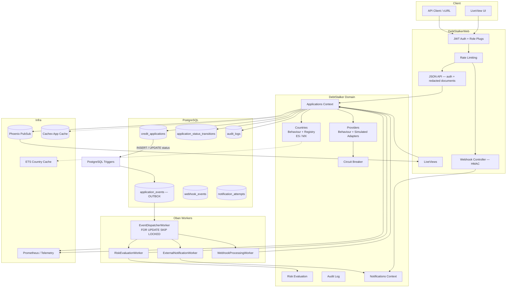
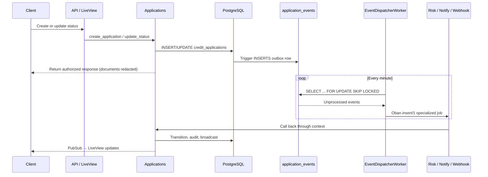

# Debt Stalker

Multi-country credit-application core for a fintech operating in 6 countries
(ES, PT, IT, MX, CO, BR). Built with **Elixir + Phoenix + PostgreSQL + Oban +
LiveView**.

## Architecture



### Async Backbone

The critical path from a write to background processing is:



### Key Design Decisions

- **Async outbox pattern**: Postgres triggers → `application_events` table →
  `EventDispatcherWorker` drains default batches of 50 with `FOR UPDATE SKIP LOCKED` → specialized
  workers.
- **Country modules**: Pluggable country rules via behaviour (ES: DNI + threshold,
  MX: CURP + debt ratio).
- **Provider adapters**: Simulated, deterministic responses; normalized output
  never exposes raw payloads.
- **PII at rest**: `identity_document` encrypted with AES-256-GCM (Cloak);
  identity documents are redacted to last-4 in API/UI and logs, while full names
  are visible on authorized API/UI surfaces and scrubbed from logs.
- **Pagination**: API lists use capped cursor pagination based on `(application_date, id)`;
  admin lists use bounded page pagination to support sortable operational tables.
- **Status machine**: `submitted → pending_risk → approved/rejected/additional_review`;
  all transitions validated + audited.
- **Resilience (Phase 2)**: per-country circuit breakers, dead-letter queue for
  exhausted Oban jobs, Cachex detail cache with PubSub invalidation, Hammer rate
  limiting, Prometheus metrics, and web/worker split.

## Quick Start

```bash
# Prerequisites: Elixir 1.18.x, Erlang/OTP 27.x, Docker

# Start Postgres
make up

# Setup (deps + DB + migrations + seed)
make setup

# Run Phoenix server
make run
```

Visit [`localhost:4000`](http://localhost:4000) for the LiveView UI.

### API Usage

```bash
# Health check (public) — returns {"status": "healthy"}
curl http://localhost:4000/api/health

# Liveness probe (public)
curl http://localhost:4000/api/health/live

# Readiness probe (public) — returns {"status": "ready"} or {"status": "not_ready"}
curl http://localhost:4000/api/health/ready

# Get a JWT token
curl -X POST http://localhost:4000/api/auth/token \
  -H 'Content-Type: application/json' \
  -d '{"role":"update"}'

# Create an application
curl -X POST http://localhost:4000/api/applications \
  -H 'Authorization: Bearer <token>' \
  -H 'Content-Type: application/json' \
  -d '{"country":"ES","full_name":"Juan Garcia","identity_document":"12345678Z","requested_amount":"5000","monthly_income":"2000"}'

# List applications with cursor pagination
curl "http://localhost:4000/api/applications?limit=10" \
  -H 'Authorization: Bearer <token>'

# Use the returned cursor to fetch the next page
curl "http://localhost:4000/api/applications?limit=10&cursor=<cursor>" \
  -H 'Authorization: Bearer <token>'

# Get single application
curl http://localhost:4000/api/applications/<id> \
  -H 'Authorization: Bearer <token>'

# Update status
curl -X PATCH http://localhost:4000/api/applications/<id>/status \
  -H 'Authorization: Bearer <token>' \
  -H 'Content-Type: application/json' \
  -d '{"status":"approved"}'

# List with filters (country, status, date range)
curl "http://localhost:4000/api/applications?country=ES&status=pending_risk&date_from=2026-01-01&date_to=2026-12-31&limit=10" \
  -H 'Authorization: Bearer <token>'

# Inbound provider webhook (signature required in production)
curl -X POST http://localhost:4000/api/webhooks/provider-confirmations \
  -H 'Content-Type: application/json' \
  -H 'x-webhook-signature: <hmac-sha256-signature>' \
  -d '{"application_id":"<id>","status":"approved","source":"provider_es"}'
```

## Development

```bash
make test       # Run test suite
make coverage   # Run tests with 85% coverage gate
make lint       # Credo strict
make dialyzer   # Type checking
make check      # format + credo + dialyzer
make ci         # Full CI pipeline locally
make docs       # Generate ExDoc
make format     # Format code
make up         # Start Postgres (Docker Compose)
make down       # Stop Postgres
make seed       # Create demo apps + print JWT tokens
```

### Observability

- **Prometheus metrics**: `http://localhost:9568/metrics` (when the app is running).
- **LiveDashboard** (dev): `http://localhost:4000/dev/dashboard` — requires
  `dev_routes` enabled.
- **Structured logs**: JSON via `logger_json` in all environments.

## Security

- **JWT authentication**: Protected API endpoints require Bearer token; public:
  `GET /api/health*`, `POST /api/auth/token`.
- **Role-based access**: `read` (list/get) vs `update` (create/patch status).
- **PII encryption**: `identity_document` encrypted at rest with AES-256-GCM via Cloak.
- **Redaction**: API/UI responses show identity documents as `****XXXX` (last-4 only).
  Full names are shown to authorized API/UI users, but full names and identity documents
  are scrubbed from application logs.
- **Webhook verification**: HMAC-SHA256 signature validation using `WEBHOOK_SECRET`
  (required in production).

## Scalability & Large Volumes

The system is designed to grow to **millions of credit applications**:

| Technique | Status | Notes |
|-----------|--------|-------|
| **API cursor pagination** | Implemented | API uses capped `(application_date, id)` cursors and avoids `OFFSET` degradation. |
| **Admin page pagination** | MVP | Admin tables use bounded page pagination for flexible sorting; high-volume admin search should move to sort-specific keyset pagination or indexed search. |
| **Composite indexes** | Implemented | `(country, status, application_date)`, `(application_date)`, `identity_document_hash`. |
| **Outbox consumption** | Implemented | `FOR UPDATE SKIP LOCKED` batches are parallel-safe; defaults drain up to 5 batches × 50 events per dispatcher run, configurable via env. |
| **App detail cache** | Implemented | Cachex with 60s TTL + PubSub invalidation on status change. |
| **Web/worker split** | Implemented | k8s `deployment-web` can disable queues via `OBAN_QUEUES=false`; `deployment-worker` scales independently. |
| **Range partitioning** | Planned (Phase 4) | Partition `credit_applications` by `application_date` (e.g., monthly ranges). Keeps hot data small and enables partition pruning. |
| **Read replicas** | Planned (Phase 4) | Offload list/detail queries to replica(s); writes stay on primary. |
| **Archiving** | Planned (Phase 4) | Move old `audit_logs` and `notification_attempts` to cold storage; keep working set small. |
| **Dashboard analytics** | MVP | Current dashboard runs aggregation queries. At very high volume, replace with daily rollups or materialized stats. |

### Current MVP scale envelope

The MVP uses scale-ready primitives, but it has not been load-tested at million-row volume. Current defaults are intentionally conservative: API lists cap cursor pages at 100 records, admin lists are bounded but offset-based for sortable operations, and the outbox dispatcher drains up to 250 events per run by default. For sustained high volume, tune dispatcher batch/cadence, alert on outbox lag metrics, add sort-specific indexes or keyset cursors for admin tables, and replace live dashboard aggregates with rollups or materialized stats.

### Recommended indexes today

```sql
-- Core list/filter queries
CREATE INDEX idx_applications_country_status_date
  ON credit_applications (country, status, application_date DESC);

-- Encrypted document lookup
CREATE INDEX idx_applications_identity_document_hash
  ON credit_applications (identity_document_hash);

-- Outbox drainer depth/lag query
CREATE INDEX application_events_unprocessed_inserted_at_idx
  ON application_events (inserted_at)
  WHERE processed_at IS NULL;

-- Status-transition history
CREATE INDEX idx_status_transitions_application_id
  ON application_status_transitions (application_id, inserted_at DESC);
```

## Concurrency, Queues & Cache

- **Queues**: Oban on PostgreSQL. Queues: `default`, `events`, `notifications`.
  Concurrency is env-configurable.
- **Cache**: Cachex for application detail reads, invalidated via PubSub on every
  status change. ETS caches static country/provider config at boot.
- **Concurrency safety**: Outbox dispatcher uses `FOR UPDATE SKIP LOCKED` inside
  transactional batches so multiple dispatcher jobs can claim work without conflicts.
  Current defaults drain up to 5 batches of 50 events per run. Production throughput
  can tune `EVENT_DISPATCHER_BATCH_SIZE`, `EVENT_DISPATCHER_MAX_BATCHES_PER_RUN`,
  cron cadence, and worker replicas together. Dispatcher runs emit processed/failed,
  remaining backlog, and oldest-event-age metrics. Status transitions are validated
  idempotently through the `Applications` context.

## Deployment

Kubernetes manifests are in `k8s/`:

- `namespace.yaml`
- `configmap.yaml`
- `secret.yaml`
- `migration-job.yaml`
- `deployment-web.yaml`
- `deployment-worker.yaml`
- `service.yaml`
- `hpa-worker.yaml`

The worker deployment disables web queues with `OBAN_QUEUES=false`; the worker
 deployment runs Oban queues and scales via HPA. See `scripts/deploy.sh` and
 `scripts/scaling-demo.sh` for local-cluster demonstrations.

## Environment Variables

All secrets are sourced from environment variables (or k8s Secrets in production).
No secrets are committed to the repository.

| Variable | Required in prod | Description |
|----------|-----------------|-------------|
| `DATABASE_URL` | Yes | Ecto database connection string |
| `SECRET_KEY_BASE` | Yes | Phoenix secret key base (`mix phx.gen.secret`) |
| `CLOAK_KEY` | Yes | Base64-encoded 32-byte key for PII encryption at rest |
| `JWT_SECRET` | Yes | Secret for signing JWT tokens |
| `WEBHOOK_SECRET` | Yes | HMAC signing secret for inbound webhooks |
| `ADMIN_PASSWORD` | Yes | Password for the browser admin dashboard |
| `LIVE_VIEW_SIGNING_SALT` | Yes | Signing salt for LiveView tokens |
| `PHX_HOST` | No | Hostname for URL generation (default: `localhost`) |
| `PORT` | No | HTTP port (default: `4000`) |
| `PHX_SERVER` | No | Start Phoenix server (default: `false`) |
| `POOL_SIZE` | No | DB connection pool size (default: `10`) |
| `OBAN_QUEUES` | No | Set to `false` to disable Oban queues (web deployment) |
| `OBAN_QUEUE_DEFAULT` | No | Default queue concurrency (default: `10`) |
| `OBAN_QUEUE_EVENTS` | No | Events queue concurrency (default: `20`) |
| `OBAN_QUEUE_NOTIFICATIONS` | No | Notifications queue concurrency (default: `10`) |
| `EVENT_DISPATCHER_BATCH_SIZE` | No | Outbox events claimed per batch (default: `50`) |
| `EVENT_DISPATCHER_MAX_BATCHES_PER_RUN` | No | Max batches drained by one dispatcher job (default: `5`) |
| `LOG_LEVEL` | No | Log level (default: `info` in prod) |
| `RATE_LIMIT_AUTH_TOKEN` | No | Auth token rate limit per window (default: `10`) |
| `RATE_LIMIT_WEBHOOK` | No | Webhook rate limit per window (default: `20`) |
| `APP_CACHE_TTL_MS` | No | Detail cache TTL in ms (default: `60000`) |

## Documentation

- [Master Plan](docs/master-plan.md)
- [Requirements](docs/requirements.md)
- [Phase 0 — Foundation](docs/phases/phase-0.md)
- [Phase 1 — ES+MX Vertical](docs/phases/phase-1.md)
- [Phase 2 — Resilience](docs/phases/phase-2.md)
- [Phase 2 Continuation — Improvements](docs/handoff/phase-2-continuation.md)
- [How to Add a Country](docs/how-to-add-country.md)
- [AGENTS.md](AGENTS.md) — Development conventions
- [ADRs](docs/adr/) — Architecture Decision Records
- [CHANGELOG](CHANGELOG.md) — Release history
- [API Postman Collection](docs/postman/debt-stalker.json)
- [ExDoc API Reference](doc/api-reference.html) — run `make docs` to regenerate

## License

See [LICENSE](LICENSE).
