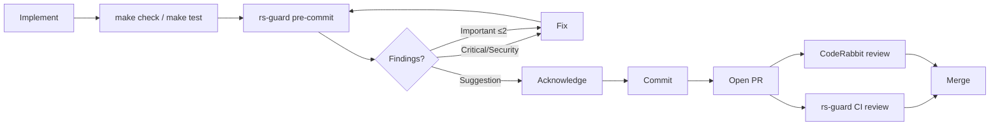

# 01 — Methodology & Conventions

This document explains how the project is organized, how it expects engineers to work, and the non-functional contracts (error handling, logging, review) that govern every module.

---

## 1. Repository Layout

```text
debt-stalker/
├── AGENTS.md                 # Canonical dev/agent conventions (this analysis uses it heavily)
├── README.md                 # User-facing runbook, architecture diagrams, API examples
├── docs/
│   ├── master-plan.md        # Roadmap, invariants, architecture decisions
│   ├── requirements.md       # Original challenge brief
│   ├── phases/               # Per-phase scope and reports
│   ├── adr/                  # Architecture Decision Records
│   ├── handoff/              # Session-starter prompts for agents
│   └── postman/              # API collection
├── lib/
│   ├── debt_stalker/         # Domain contexts
│   │   ├── applications/     # CreditApplication, StatusTransition, AuditLog schemas
│   │   ├── countries/        # Behaviour, Registry, ES, MX
│   │   ├── providers/        # Behaviour, Registry, ES/MX adapters, CircuitBreaker
│   │   ├── workers/          # Oban workers
│   │   ├── dead_letter/      # DLQ schema
│   │   ├── notifications/    # WebhookEvent, NotificationAttempt schemas
│   │   ├── vault/            # Cloak encryption
│   │   └── *.ex              # Top-level contexts: Applications, Risk, Audit, Notifications
│   ├── debt_stalker_web/     # Transport layer
│   │   ├── controllers/api/  # API controllers
│   │   ├── live/             # LiveViews
│   │   ├── components/       # Reusable UI components
│   │   ├── plugs/            # Auth, rate limit, locale, raw body reader
│   │   └── auth/             # JWT token/plugs
│   ├── debt_stalker.ex       # Domain root module
│   └── debt_stalker_web.ex   # Web interface macros
├── test/
│   ├── debt_stalker/         # Domain tests
│   ├── debt_stalker_web/     # Web tests
│   └── support/              # DataCase, ConnCase, custom Credo checks
├── config/                   # config.exs, dev/test/prod/runtime.exs
├── k8s/                      # Kubernetes manifests
├── scripts/                  # deploy.sh, scaling-demo.sh
├── docker-compose.yml        # Local Postgres only
└── Dockerfile                # Multi-stage release build
```

---

## 2. Methodology: Spec-Driven Development & TDD

The project uses **Spec-Driven Development** (master-plan §8.1) and a hard **TDD gate** for certain task types.

### Task-type prefixes

| Prefix | TDD gate | Examples |
|--------|----------|----------|
| `[DOMAIN]` | Test-first mandatory | Country rules, validation, financial thresholds |
| `[ASYNC]` | Test-first mandatory | Workers, event processing, outbox flows |
| `[API]` | Test-first mandatory | Controllers, serializers, endpoint contracts |
| `[WEB]` | Test-first mandatory | LiveViews, components, frontend interaction |
| `[CHORE]` | Exempt | Dependency updates, formatting |
| `[INFRA]` | Exempt (tests where applicable) | CI/CD, Docker, tooling |
| `[DB]` | Exempt | Ecto migrations (reversibility handled by Ecto) |
| `[OPS]` | Exempt | k8s manifests, deployment scripts |
| `[DOCS]` | Exempt | Documentation-only changes |

### TDD workflow (from `AGENTS.md`)

1. Write a failing test for the acceptance criteria.
2. Run it and verify it fails for the **right reason** (feature missing, not a syntax error).
3. Implement minimal code to pass.
4. Run the test and verify it passes.
5. Run the full quality suite (see §7 below).
6. Run the `rs-guard` pre-commit hook.
7. Iterate (max 3 rounds).
8. Commit only when `rs-guard` returns `APPROVE` or `COMMENT`.

### PR strategy

- **One PR per issue**, not one PR per phase.
- Branch from `main`, tag with the appropriate `phase-N` label.
- Keep PRs small and focused.
- If an issue depends on another, wait for the dependency PR to merge first.

---

## 3. Code Organization Contract

This is the single most important rule in the codebase. It is enforced by architecture, Credo custom checks, and rs-guard review.

### Context boundaries

| Module | Owns | Must NOT |
|--------|------|----------|
| `DebtStalker.Countries` | Document/financial validation, rule interpretation, allowed transitions | Access DB, web |
| `DebtStalker.Providers` | Fetch + normalize provider data | Make decisions, persist raw payloads |
| `DebtStalker.Applications` | Lifecycle: create, get, list, update_status; orchestration | Contain country rules |
| `DebtStalker.Risk` | Async risk evaluation logic | Access web/transport |
| `DebtStalker.Audit` | Append-only audit records (read side) | Make business decisions |
| `DebtStalker.Notifications` | Outbound notifications + inbound webhooks | Contain country rules |
| `DebtStalker.Workers` | Oban workers (delegate to contexts) | Contain business rules |
| `DebtStalkerWeb` | Transport, auth, serialization, LiveView | Contain domain logic |

### Hard rules

1. **No country/provider branching** (`if country == "ES"`) outside `DebtStalker.Countries` and `DebtStalker.Providers`. Custom Credo check `DebtStalker.CredoChecks.NoCountryBranching` enforces this (`.credo.exs:104`).
2. **Workers delegate** — they call context functions, never implement business logic.
3. **Web layer calls contexts only** — never reaches into internal modules.
4. **Raw provider payloads are never persisted or exposed** — only normalized `provider_summary`.
5. Every public module has `@moduledoc`, every public function has `@doc` and `@spec`, every `@type`/`@opaque` has `@typedoc`.
6. Prefer pattern matching over `if/cond`; use `with` for multi-step happy paths.
7. Use `Decimal` for financial calculations; `application_date` is always server-set.
8. Full `identity_document` is never logged; responses redact to last-4.

### Where the contract is slightly bent

- The web layer calls `DebtStalker.Countries.Registry.supported_countries/0` directly in a few LiveViews instead of going through `DebtStalker.Countries` (`lib/debt_stalker_web/live/apply/application_form_live.ex`, `lib/debt_stalker_web/live/admin/dashboard_live.ex`, `lib/debt_stalker_web/live/admin/applications_live.ex`).
- Controllers call `DebtStalker.Applications.CreditApplication.redact_document/1` directly (`lib/debt_stalker_web/controllers/api/application_controller.ex:156`) instead of a context redaction function.
- Some LiveView `handle_event/3` and `handle_info/2` callbacks lack `@spec` despite being public callbacks.

These are documented as gaps in [`08-gaps-and-recommendations.md`](08-gaps-and-recommendations.md).

---

## 4. Review Loop

Every task goes through an automated review loop.



### Severity handling

| Severity | Action |
|----------|--------|
| `[Critical]` / `[Security]` | Must fix before commit |
| `[Important]` | Fix if ≤ 2 findings; document if deferred |
| `[Suggestion]` | Optional — fix or acknowledge |

### Bypass

Emergency bypass exists via `git commit --no-verify`, but it is strongly discouraged.

---

## 5. Error Handling Strategy

The project uses consistent error shapes across layers.

| Layer | Success | Error |
|-------|---------|-------|
| Domain contexts | `{:ok, struct}` | `{:error, %Ecto.Changeset{}}` or `{:error, atom}` |
| Oban workers | `:ok` | `{:cancel, reason}` (permanent) or `{:error, reason}` (transient/retry) |
| API controllers | `200` with data | `422` validation, `401`/`403` auth, `404` not found |
| Webhook controller | `200` `{"received": true}` | `401` bad signature, `404` unknown app, `422` invalid payload |
| LiveView | `{:ok, socket}` | `{:error, changeset}` inline or redirect with flash |

### Domain error atoms

`:not_found`, `:invalid_transition`, `:provider_timeout`, `:provider_unavailable`, `:invalid_document`, `:unsupported_country`, `:already_processed`.

### Examples in code

- `DebtStalker.Applications.update_status/3` returns `{:error, :not_found}`, `{:error, :invalid_transition}`, or `{:error, changeset}` (`lib/debt_stalker/applications.ex:184`).
- `DebtStalker.Workers.WebhookProcessingWorker.perform/1` returns `{:cancel, :not_found}` for permanent failures (`lib/debt_stalker/workers/webhook_processing_worker.ex:27`).
- `DebtStalkerWeb.Api.ApplicationController.update_status/2` maps these atoms to HTTP statuses (`lib/debt_stalker_web/controllers/api/application_controller.ex:77`).

---

## 6. Logging Specification

| Aspect | Decision |
|--------|----------|
| Backend | `logger_json` (structured JSON) in all environments |
| Format | JSON with timestamp, level, message, metadata |
| Required metadata | `application_id`, `event_id`, `country`, `status`, `worker` |
| Log levels | dev: `debug`, test: `warning`, prod: `info` |
| PII redaction | `identity_document` → last-4; `full_name` → first + last initial; no raw provider payloads |

### Configuration

`config/config.exs:68-95` wires `logger_json` and registers the metadata keys used across the app:

```elixir
config :logger, :default_handler, formatter: {LoggerJSON.Formatters.Basic, metadata: :all}

config :logger, :default_formatter,
  metadata: [
    :application_id, :country, :status, :from_status, :to_status,
    :worker, :event_id, :event_type, :event_count, :failed_count, ...
  ]
```

### Examples

- Application creation logs `application_id`, `country`, `status` but **never** the full identity document (`lib/debt_stalker/applications.ex:50`).
- Status transition logs `application_id`, `country`, `status`, `from_status` (`lib/debt_stalker/applications.ex:265`).
- The circuit breaker logs only `exception.__struct__` and `Exception.message(exception)`, never the full stacktrace or raw provider response (`lib/debt_stalker/providers/circuit_breaker.ex:147`).

---

## 7. Quality Suite

The full local quality suite is defined in `AGENTS.md` §7 and the `Makefile`.

```bash
mix format --check-formatted && \
mix compile --warnings-as-errors && \
mix credo --strict && \
mix dialyzer && \
mix test --cover
```

### Makefile commands

| Command | Purpose |
|---------|---------|
| `make setup` | Install deps, create DB, run migrations |
| `make db` | Create + migrate database |
| `make migrate` | Run migrations |
| `make seed` | Run seeds |
| `make run` | Start Phoenix server |
| `make test` | Run full test suite |
| `make coverage` | Run tests with 85% threshold |
| `make format` | Format code |
| `make lint` | Run `mix credo --strict` |
| `make dialyzer` | Run Dialyzer |
| `make docs` | Generate ExDoc |

### Coverage

`mix.exs:25-28` sets the coverage threshold to **85%** and ignores boilerplate modules (`Endpoint`, `CoreComponents`, `ErrorHTML`, `Gettext`, `Layouts`, `Mailer`, `PageHTML`).

---

## 8. Style & ExDoc Contract

- Every public module has `@moduledoc`.
- Every public function has `@doc` and `@spec`.
- Every `@type`/`@opaque` has `@typedoc`.
- `mix docs` must generate without warnings.
- `.formatter.exs` covers `.heex`, migrations, seeds, and Elixir sources.

The custom `RequireSpec` Credo check enforces `@spec` on public functions (`test/support/credo_checks/require_spec.ex`).

---

## 9. Key Takeaways

- The project is organized around **strict context boundaries** and **behaviours/registries** for extensibility.
- **TDD is mandatory** for domain, async, API, and web work.
- **Quality is automated**: format, compile warnings-as-errors, Credo strict, Dialyzer, coverage, rs-guard, CodeRabbit.
- **Error handling and logging are contract-first**, with consistent shapes and PII redaction requirements.
- The main **methodology risks** are drift from the contract (web layer reaching into registries/schemas) and gaps in automated enforcement (no `@doc` check, `NoCountryBranching` misses function-head branching).
