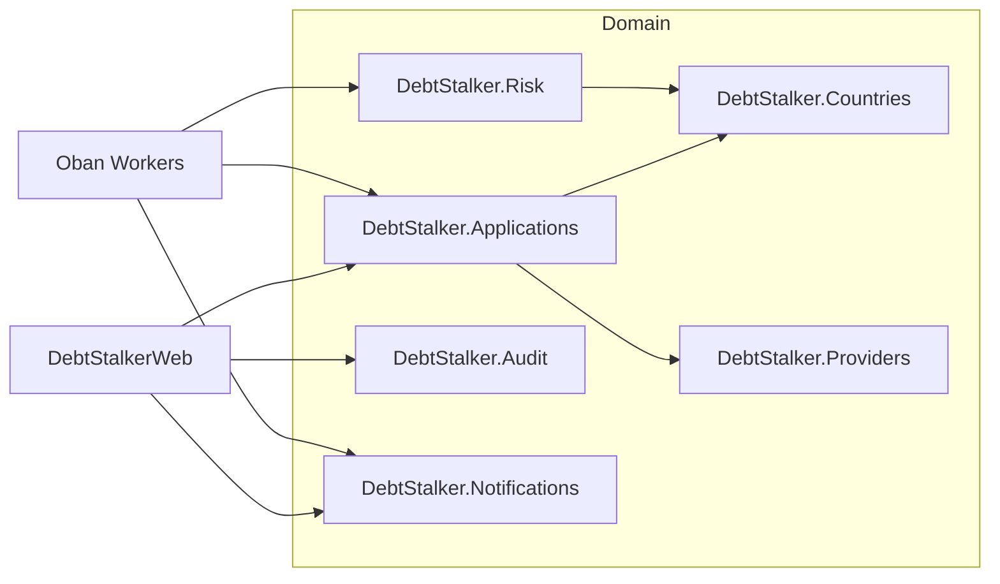
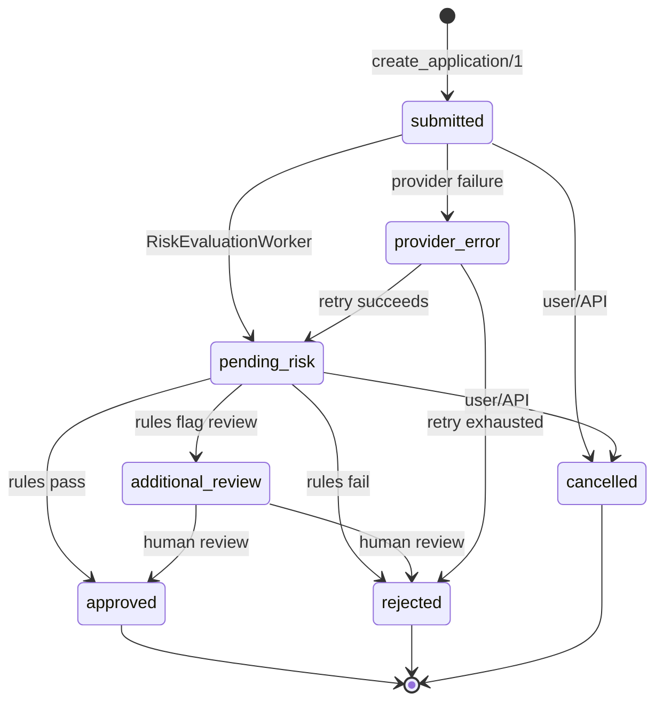

# 02 — Domain & Business Logic

This document describes the domain layer: the contexts, schemas, status machine, country/provider rules, and PII handling that sit at the heart of Debt Stalker.

---

## 1. Domain Contexts

The domain lives under `lib/debt_stalker/` (excluding `lib/debt_stalker_web/`). Each context is a public API surface; internal modules implement the details.



### `DebtStalker.Applications`

**File:** `lib/debt_stalker/applications.ex`

The primary lifecycle context. It orchestrates validation, provider enrichment, persistence, status transitions, listing, pagination, and analytics.

| Function | Responsibility |
|----------|----------------|
| `create_application/1` | Resolve country → validate document → evaluate financials → fetch provider summary → insert application |
| `update_status/3` | Validate transition → update status → record transition row → audit log → PubSub broadcast → cache invalidation |
| `get_application/1` | Cache-backed fetch by UUID |
| `list_applications/1` | Filtered list with cursor **or** page pagination |
| `allowed_transitions/1` | Intersection of global and country-specific transitions |
| `count_applications/1`, `count_decided_today/1`, `dashboard_analytics/1`, `dashboard_stats/1` | Admin dashboard KPIs |

Key code references:

- `create_application/1` entry point: `lib/debt_stalker/applications.ex:32`.
- `update_status/3` entry point: `lib/debt_stalker/applications.ex:187`.
- Global transition map: `lib/debt_stalker/applications.ex:171-176`.
- Transition validation logic: `lib/debt_stalker/applications.ex:222-235`.
- Cache-backed `get_application/1`: `lib/debt_stalker/applications.ex:304-352`.

### `DebtStalker.Countries`

**File:** `lib/debt_stalker/countries.ex`

A thin public wrapper around the country registry. It exposes UI helpers (`get_document_hint/1`, `currency_symbol/1`, `random_identity_document/1`) so callers do not reach into `Countries.Registry` directly. Core validation functions (`validate_document/1`, `validate_financials/1`) are reached through the registry by `Applications`.

### `DebtStalker.Providers`

There is no single `DebtStalker.Providers` context module. Instead, `Applications` calls:

- `DebtStalker.Providers.Registry.lookup/1` to resolve the adapter.
- `DebtStalker.Providers.CircuitBreakers.lookup/1` to resolve the circuit breaker.
- `DebtStalker.Providers.CircuitBreaker.call/2` to execute the adapter call.

This is a minor contract gap: a thin `Providers.fetch/2` facade would tighten the boundary.

### `DebtStalker.Risk`

**File:** `lib/debt_stalker/risk.ex`

Delegates to the country module to determine whether additional review is required and whether the provider risk score is acceptable. Returns the target status (`approved`, `rejected`, `additional_review`).

Key code references:

- `Risk.evaluate/1`: `lib/debt_stalker/risk.ex:34-56`.
- Provider debt extraction from normalized summary: `lib/debt_stalker/risk.ex:72-80`.
- Optional `acceptable_risk_score?/1` handling: `lib/debt_stalker/risk.ex:87-93`.

### `DebtStalker.Audit`

**File:** `lib/debt_stalker/audit.ex`

Read-side context for audit logs. Writes are owned by `Applications.update_status/3` because the transition and audit log share the same Ecto transaction.

### `DebtStalker.Notifications`

**File:** `lib/debt_stalker/notifications.ex`

Context for inbound webhook events and outbound notification attempts. Provides idempotency checks and persistence.

---

## 2. Core Schemas

### `DebtStalker.Applications.CreditApplication`

**File:** `lib/debt_stalker/applications/credit_application.ex`

```elixir
schema "credit_applications" do
  field :country, :string
  field :full_name, :string
  field :identity_document, DebtStalker.Vault.EncryptedBinary
  field :identity_document_hash, :string
  field :requested_amount, :decimal
  field :monthly_income, :decimal
  field :application_date, :utc_datetime_usec
  field :status, :string, default: "submitted"
  field :additional_review_required, :boolean, default: false
  field :provider_summary, :map
  field :risk_result, :map
  timestamps()
end
```

Key design points:

- `identity_document` uses `DebtStalker.Vault.EncryptedBinary` (Cloak) for encryption at rest.
- `identity_document_hash` is a SHA-256 hash used for lookup/dedup without decryption.
- `application_date` is server-set in `put_application_date/1` (`lib/debt_stalker/applications/credit_application.ex:76`).
- `requested_amount` and `monthly_income` are `Decimal`, never floats.
- `status` default is `"submitted"`.

Validation in `changeset/2`:

- Required fields: `country`, `full_name`, `identity_document`, `requested_amount`, `monthly_income`.
- Status must be in `@valid_statuses` (`lib/debt_stalker/applications/credit_application.ex:17`).
- Country must be in `Registry.supported_countries/0`.
- Amounts must be > 0.
- Computes `identity_document_hash` and `application_date` automatically.

### `DebtStalker.Applications.StatusTransition`

**File:** `lib/debt_stalker/applications/status_transition.ex`

Records every valid status change with `from_status`, `to_status`, `triggered_by`, and timestamps. Used by `Applications.update_status/3` and dashboard analytics.

### `DebtStalker.Applications.AuditLog`

**File:** `lib/debt_stalker/applications/audit_log.ex`

Append-only audit records with `action`, `actor`, and `metadata`. Written inside the same transaction as status transitions.

### `DebtStalker.Notifications.WebhookEvent`

**File:** `lib/debt_stalker/notifications/webhook_event.ex`

Stores metadata for inbound webhooks: `application_id`, `source`, `payload_hash`, `verified`, `processed`. Raw payloads are **not** persisted (the `raw_payload` column was removed in migration `20260622050000`).

### `DebtStalker.Notifications.NotificationAttempt`

**File:** `lib/debt_stalker/notifications/notification_attempt.ex`

Stores outbound notification attempts with `notification_type`, `status`, `endpoint`, `response_code`, `response_body`.

---

## 3. Status Machine



### Global transitions

Defined in `lib/debt_stalker/applications.ex:171-176`:

```elixir
@global_transitions %{
  "submitted" => ["pending_risk", "provider_error", "cancelled"],
  "pending_risk" => ["additional_review", "approved", "rejected", "cancelled"],
  "additional_review" => ["approved", "rejected"],
  "provider_error" => ["pending_risk", "rejected"]
}
```

### Country narrowing

Country modules implement `allowed_status_transitions/0` and return a map that can narrow the global set. For ES and MX, the maps currently match the global set exactly (`lib/debt_stalker/countries/es.ex:67`, `lib/debt_stalker/countries/mx.ex:78`).

`Applications.allowed_transitions/1` intersects the global set with the country set:

```elixir
global_allowed -- (global_allowed -- country_allowed)
```

See `lib/debt_stalker/applications.ex:207-220`.

---

## 4. Country Rules

### Behaviour contract

**File:** `lib/debt_stalker/countries/behaviour.ex`

Callbacks every country module must implement:

| Callback | Purpose |
|----------|---------|
| `validate_document/1` | Document format + checksum validation |
| `validate_financials/1` | Amount/income/debt threshold checks |
| `interpret_provider_summary/1` | Normalize provider data for risk |
| `additional_review_required?/1` | Whether thresholds flag review |
| `acceptable_risk_score?/1` | Whether provider score is acceptable (optional) |
| `allowed_status_transitions/0` | Country-specific status narrowing |
| `risk_score_threshold/0` | Minimum acceptable provider score |
| `document_hint/0` | UI placeholder (optional) |
| `currency_symbol/0` | Currency symbol for UI |

Optional callbacks are declared as `acceptable_risk_score?/1` and `document_hint/0`, but the code also calls `random_identity_document/0` conditionally without declaring it optional. This is a small inconsistency.

### Spain (`DebtStalker.Countries.ES`)

**File:** `lib/debt_stalker/countries/es.ex`

- **Document:** Spanish DNI — 8 digits + checksum letter.
- **Validation:** `validate_document/1` parses and verifies the checksum against the standard `TRWAGMYFPDXBNJZSQVHLCKE` table (`lib/debt_stalker/countries/es.ex:17-24`).
- **Financial rules:**
  - Amount > €15,000 → flag `amount_exceeds_threshold`.
  - Amount > 12× monthly income → flag `income_ratio_exceeded`.
- **Risk score:** credit_score ≥ 650 is acceptable (`lib/debt_stalker/countries/es.ex:57-62`).
- **Document hint:** `"12345678Z (DNI)"`.

### Mexico (`DebtStalker.Countries.MX`)

**File:** `lib/debt_stalker/countries/mx.ex`

- **Document:** Mexican CURP — 18-character uppercase alphanumeric.
- **Validation:** regex `^[A-Z]{4}\d{6}[A-Z0-9]{6}[A-Z0-9]{2}$` (`lib/debt_stalker/countries/mx.ex:17-31`). No official checksum is implemented; this is a documented simplification.
- **Financial rules:**
  - Amount > 10× monthly income → flag `income_ratio_exceeded`.
  - `provider_debt + amount > 18× monthly income` → flag `debt_ratio_exceeded`.
- **Risk score:** `buro_score` ≥ 600 is acceptable (`lib/debt_stalker/countries/mx.ex:68-73`).
- **Document hint:** `"GARC850101HDFRRL09 (CURP)"`.

### Registry

**File:** `lib/debt_stalker/countries/registry.ex`

ETS-backed registry loaded at boot. `default_countries/0` returns `[{"ES", ES}, {"MX", MX}]`. Lookups are O(1). The registry is started in the supervision tree (`lib/debt_stalker/application.ex:22`).

---

## 5. Provider Adapters

### Behaviour contract

**File:** `lib/debt_stalker/providers/behaviour.ex`

```elixir
@callback fetch(country :: String.t(), params :: map()) :: fetch_result()
```

The adapter returns a normalized `provider_summary` map:

```elixir
%{
  provider_status: String.t(),
  risk_indicators: map(),
  normalized_data: map()
}
```

Raw payloads are never returned or persisted.

### Spain adapter (`DebtStalker.Providers.ESAdapter`)

**File:** `lib/debt_stalker/providers/es_adapter.ex`

Deterministic simulation based on document hash:

- Documents starting with `"00000000"` → `:unavailable`.
- Documents starting with `"99999999"` → `:timeout`.
- Otherwise returns `credit_score`, `active_loans`, `bank_name`, `monthly_payment`.

### Mexico adapter (`DebtStalker.Providers.MXAdapter`)

**File:** `lib/debt_stalker/providers/mx_adapter.ex`

- Documents starting with `"XXXX"` → `:unavailable`.
- Documents starting with `"ZZZZ"` → `:timeout`.
- Otherwise returns `buro_score`, `existing_debt`, `institution`, `payment_history`.
- Supports test overrides via `:mx_simulated_debt_overrides` config.

### Provider summary struct

**File:** `lib/debt_stalker/providers/provider_summary.ex`

Wraps the normalized map and is what gets stored in `credit_applications.provider_summary`.

---

## 6. PII Handling

### Encryption at rest

- `identity_document` is stored as ciphertext via `DebtStalker.Vault.EncryptedBinary`.
- `DebtStalker.Vault` configures Cloak with AES-256-GCM in `config/runtime.exs:103-109`.
- `identity_document_hash` is a SHA-256 hash used for lookup/dedup without decrypting.

### Redaction helpers

**File:** `lib/debt_stalker/applications/credit_application.ex:89-125`

- `redact_document/1` masks all but the last 4 characters: `"12345678Z"` → `"****78Z"`.
- `redact_full_name/1` returns `"Juan L."` for `"Juan Garcia Lopez"`.

### Where redaction is applied

- API controllers call `CreditApplication.redact_document/1` on the identity document (`lib/debt_stalker_web/controllers/api/application_controller.ex:156`).
- Logs never include the full identity document.

### Gap: full name is not redacted

Despite `redact_full_name/1` existing, the API and LiveViews render `full_name` verbatim. This violates the logging contract that says full names should be scrubbed from logs and responses should show first + last initial. See [`08-gaps-and-recommendations.md`](08-gaps-and-recommendations.md).

---

## 7. Domain Layer Gaps

| # | Issue | Severity | Evidence |
|---|-------|----------|----------|
| 1 | **Non-existent `from_status: "created"`** in provider-error transition | Medium | `lib/debt_stalker/applications.ex:111` records a transition from `"created"`, but `"created"` is not in `CreditApplication.valid_statuses/0` (`lib/debt_stalker/applications/credit_application.ex:17`). |
| 2 | **No top-level `DebtStalker.Providers` facade** | Low | `Applications` reaches into `Providers.Registry`, `Providers.CircuitBreakers`, and `Providers.CircuitBreaker` directly. |
| 3 | **Optional callback inconsistency** | Low | `random_identity_document/0` is called conditionally but not declared in `@optional_callbacks` (`lib/debt_stalker/countries/behaviour.ex:45`). |
| 4 | **Duplicated transition logic** | Low | `allowed_transitions/1` and `transition_allowed?/2` repeat the same global/country intersection code (`lib/debt_stalker/applications.ex:207-235`). |
| 5 | **Full name not redacted in responses/UI** | High (contract/PII) | `CreditApplication.redact_full_name/1` exists but is unused in `ApplicationController` and all admin/applicant LiveViews. |
| 6 | **CURP validation is format-only** | Low | No checksum validation for Mexico; documented simplification. |

---

## 8. Adding a Third Country

The architecture is designed to be additive. To add, for example, Portugal (`PT`):

1. Create `lib/debt_stalker/countries/pt.ex` implementing `DebtStalker.Countries.Behaviour`.
2. Create `lib/debt_stalker/providers/pt_adapter.ex` implementing `DebtStalker.Providers.Behaviour`.
3. Add `{ "PT", DebtStalker.Countries.PT }` to the default countries list in `Countries.Registry.default_countries/0`.
4. Add `{ "PT", DebtStalker.Providers.PTAdapter }` to the default providers list in `Providers.Registry.default_providers/0`.
5. Add `DebtStalker.Providers.CircuitBreakers` registration for PT.
6. Add property-based and table tests for the new document format and rules.

No controller, schema, worker, or UI changes are required.
