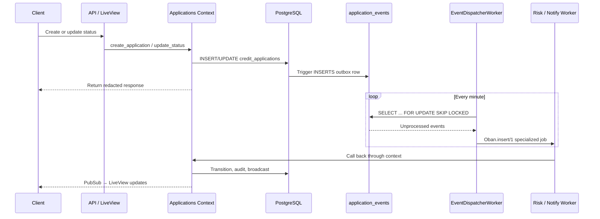

# 03 — Async & Resilience

This document explains the asynchronous backbone of Debt Stalker: the Postgres-trigger outbox, the dispatcher, the Oban workers, the circuit breakers, the dead-letter queue, cache invalidation, and telemetry. These are the pieces that make the system production-credible.

---

## 1. The Async Backbone

The system does not enqueue Oban jobs directly from controllers. Instead, database writes generate events through Postgres triggers into an `application_events` outbox table. A cron-driven `EventDispatcherWorker` drains the outbox with `FOR UPDATE SKIP LOCKED` and enqueues specialized workers.



### Why triggers + outbox?

1. **Durability:** The event is committed in the same transaction as the write. If the write succeeds, the event exists.
2. **Decoupling:** The write path does not depend on Oban being up.
3. **Ordering/Idempotency:** Events are consumed in insertion order and workers are idempotent.
4. **Concurrency safety:** `FOR UPDATE SKIP LOCKED` allows multiple dispatcher instances to claim disjoint batches.

---

## 2. Postgres Triggers

**Migration:** `priv/repo/migrations/20260620220901_add_outbox_triggers.exs`

Two triggers exist on `credit_applications`:

### `trg_application_created`

Fires `AFTER INSERT` and creates an `application.created` event:

```sql
INSERT INTO application_events (id, application_id, event_type, payload, inserted_at)
VALUES (
  gen_random_uuid(),
  NEW.id,
  'application.created',
  jsonb_build_object('country', NEW.country, 'status', NEW.status),
  NOW()
);
```

### `trg_application_status_changed`

Fires `AFTER UPDATE OF status` only when the status changed (`OLD.status IS DISTINCT FROM NEW.status`) and creates an `application.status_changed` event:

```sql
jsonb_build_object(
  'from_status', OLD.status,
  'to_status', NEW.status,
  'country', NEW.country
)
```

---

## 3. EventDispatcherWorker

**File:** `lib/debt_stalker/workers/event_dispatcher_worker.ex`

### Configuration

Defaults are in `config/config.exs:116-118`:

```elixir
config :debt_stalker, :event_dispatcher,
  batch_size: 50,
  max_batches_per_run: 5
```

Overridable via env vars in `config/runtime.exs:162-165`:

```elixir
EVENT_DISPATCHER_BATCH_SIZE=50
EVENT_DISPATCHER_MAX_BATCHES_PER_RUN=5
```

The worker is scheduled every minute via Oban cron (`config/config.exs:125-128`):

```elixir
{Oban.Plugins.Cron, crontab: [{"* * * * *", DebtStalker.Workers.EventDispatcherWorker}]}
```

### Dispatch flow

1. `perform/1` calls `claim_and_dispatch/0`.
2. `claim_and_dispatch/0` reads config, drains up to `max_batches_per_run` batches of `batch_size` events, emits telemetry, and logs a structured summary.
3. `claim_events/1` executes raw SQL with `FOR UPDATE SKIP LOCKED` (`lib/debt_stalker/workers/event_dispatcher_worker.ex:108-124`).
4. `dispatch_events/1` iterates the batch and calls `dispatch_event/1` for each event.
5. `dispatch_event/1` routes by `event_type`:
   - `"application.created"` → `RiskEvaluationWorker`
   - `"application.status_changed"` with `to_status` in `["approved", "rejected"]` → `ExternalNotificationWorker`
   - other events → no-op
6. Only after successful `Oban.insert/1` does `mark_processed/1` set `processed_at = NOW()` (`lib/debt_stalker/workers/event_dispatcher_worker.ex:186-195`).

### Idempotency

Because events are only marked processed after successful enqueue, a crash between enqueue and mark leaves the event unprocessed and it will be retried. All downstream workers are idempotent, so duplicate jobs are safe.

---

## 4. RiskEvaluationWorker

**File:** `lib/debt_stalker/workers/risk_evaluation_worker.ex`

### Responsibilities

- Move the application from `"submitted"` to `"pending_risk"`.
- Call `DebtStalker.Risk.evaluate/1` to determine the target status.
- Transition to `"approved"`, `"rejected"`, or `"additional_review"` via `Applications.update_status/3`.

### Idempotency

`ensure_evaluable/1` checks that the status is `"submitted"` or `"pending_risk"`; otherwise the worker no-ops (`lib/debt_stalker/workers/risk_evaluation_worker.ex:32-38`).

### Error semantics

- `{:error, :not_found}` → `:ok` (app deleted).
- `{:error, :not_evaluable}` → `:ok` (already processed).
- `{:error, :invalid_transition}` → `:ok` (race with another transition).
- `{:error, :unsupported_country}` → `:ok` (logged as warning).
- Other errors → `{:error, reason}` so Oban retries.

---

## 5. ExternalNotificationWorker

**File:** `lib/debt_stalker/workers/external_notification_worker.ex`

### Responsibilities

- Sends a notification when an application reaches a terminal status (`approved`/`rejected`).
- Records the attempt in `notification_attempts`.

### Idempotency

Checks `Notifications.notification_exists?/2` before sending (`lib/debt_stalker/workers/external_notification_worker.ex:52-58`).

### Simulation

If `config :debt_stalker, :notification_endpoint` is not set, the worker records a `"simulated"` delivery:

```elixir
{status, response_code, response_body} =
  if endpoint do
    {"sent", 200, "OK"}
  else
    {"simulated", 200, "Simulated notification delivery"}
  end
```

### Note on code shape

The worker has two `perform/1` clauses that repeat the same `with` block. This could be collapsed into one clause or a helper for readability.

---

## 6. WebhookProcessingWorker

**File:** `lib/debt_stalker/workers/webhook_processing_worker.ex`

### Responsibilities

- Applies the status transition requested by an inbound provider webhook.
- Marks the corresponding `webhook_events` row(s) as processed.

### Permanent vs. transient errors

- `{:error, :not_found}` → `{:cancel, :not_found}` (permanent; retrying will never find the app).
- `{:error, :invalid_transition}` → `:ok` after marking processed (retrying will never become valid).
- Success → `:ok`.

### Gap: over-broad webhook marking

`mark_webhook_processed/1` updates **all** unprocessed `webhook_events` for the application, not just the event that triggered the job:

```elixir
"UPDATE webhook_events SET processed = true WHERE application_id = $1 AND processed = false"
```

If multiple webhooks are pending for the same application, later events may be incorrectly marked processed. See [`08-gaps-and-recommendations.md`](08-gaps-and-recommendations.md).

---

## 7. Circuit Breakers

**File:** `lib/debt_stalker/providers/circuit_breaker.ex`

### Design

Each country has its own circuit breaker GenServer. The breaker tracks consecutive failures and opens after a threshold, fail-fast rejecting calls until a cooldown expires.

### States

- `:closed` — normal operation.
- `:open` — failures exceeded threshold; calls return `{:error, :circuit_open}`.
- `:half_open` — cooldown elapsed; one trial call is allowed.

### Configuration

```elixir
%{
  failure_threshold: 5,
  cooldown_ms: 30_000,
  retry_budget: 3,
  base_backoff_ms: 100
}
```

### Retry behavior

Transient errors (`:timeout`, `:unavailable`) are retried up to `retry_budget` times with exponential backoff. The retry loop runs in the **caller's process**, not the GenServer, so long sleeps do not block the breaker (`lib/debt_stalker/providers/circuit_breaker.ex:117-142`).

### Caller crash safety

When a half-open trial slot is granted, the breaker monitors the caller. If the caller crashes before reporting, the slot is freed and the breaker re-opens if it was half-open (`lib/debt_stalker/providers/circuit_breaker.ex:230-248`).

### Registry

`DebtStalker.Providers.CircuitBreakers` boots one breaker per registered provider at startup and provides `lookup/1` and `reset_all/0` (`lib/debt_stalker/providers/circuit_breakers.ex`).

---

## 8. Dead-Letter Queue (DLQ)

**File:** `lib/debt_stalker/dead_letter.ex`

### Capture

`DebtStalker.ObanTelemetryHandler` listens to `[:oban, :job, :stop]` and `[:oban, :job, :exception]` events. When a job is discarded or exhausted, it calls `DeadLetter.capture/1`.

### PII redaction

Before storage, job arguments are filtered to `@safe_keys` (`application_id`, `event_type`, `status`, `triggered_by`) and sensitive keys are replaced with `"[REDACTED]"` (`lib/debt_stalker/dead_letter.ex:288-306`).

### Idempotency

Capture is idempotent by unique index on `job_id` (`priv/repo/migrations/20260621062500_create_dead_letter_jobs.exs:19`). Race conditions are handled by returning the existing entry.

### Re-enqueue

`DeadLetter.reenqueue/1` runs in a transaction with `SELECT ... FOR UPDATE` to prevent duplicate replays. It resolves the worker module dynamically, inserts a new Oban job with the redacted args, and marks the DLQ entry with `reenqueued_at`.

### Gap: atom-table risk

`insert_reenqueued_job/2` calls `String.to_atom(entry.queue || "events")` (`lib/debt_stalker/dead_letter.ex:340`). Queue names are currently bounded, but this is a latent risk if the stored queue name becomes attacker-controlled or misconfigured.

---

## 9. Cache Invalidation

**File:** `lib/debt_stalker/cache_invalidator.ex`

`get_application/1` uses a Cachex cache-aside pattern with a configurable TTL (default 60s). When a status changes, `Applications.update_status/3` broadcasts `{:status_changed, %{application_id: app.id, ...}}` on `applications:list`. The `CacheInvalidator` GenServer subscribes to that topic and deletes the matching cache key (`lib/debt_stalker/cache_invalidator.ex:44-48`).

This keeps cache coherence without a thundering herd: only the affected entry is invalidated.

---

## 10. Telemetry

### Custom business telemetry

**File:** `lib/debt_stalker/telemetry.ex`

Emits:

- `[:debt_stalker, :status_transition, :stop]`
- `[:debt_stalker, :provider, :fetch, :stop]` and `[:debt_stalker, :provider, :latency]`
- `[:debt_stalker, :application, :created]`
- `[:debt_stalker, :outbox, :dispatch, :stop]`
- `[:debt_stalker, :oban, :job, :stop]`
- `[:debt_stalker, :cache, :hit]` / `[:debt_stalker, :cache, :miss]`

### Metric definitions

**File:** `lib/debt_stalker_web/telemetry.ex`

- `metrics/0` — generic `Telemetry.Metrics` definitions (summaries, counters).
- `prometheus_metrics/0` — Prometheus-compatible definitions that convert summaries to distributions.

The Prometheus reporter is started on port `9568` by default (`lib/debt_stalker/application.ex:28`, `lib/debt_stalker_web/telemetry.ex:48`).

### Oban telemetry bridge

**File:** `lib/debt_stalker/oban_telemetry_handler.ex`

Attaches to `[:oban, :job, :stop]` and `[:oban, :job, :exception]`, emits the normalized `[:debt_stalker, :oban, :job, :stop]` event, and captures discarded/exhausted jobs to the DLQ.

---

## 11. Async & Resilience Gaps

| # | Issue | Severity | Evidence |
|---|-------|----------|----------|
| 1 | **Audit is synchronous in `update_status/3`** | Medium | `lib/debt_stalker/applications.ex:237-300` writes the audit log in the same transaction as the status update. This contradicts the original `AuditWorker` concept and couples audit latency to transitions. |
| 2 | **Webhook flow bypasses the outbox** | Medium | `WebhookController` enqueues `WebhookProcessingWorker` directly (`lib/debt_stalker_web/controllers/api/webhook_controller.ex:128-134`), not through `application_events`. |
| 3 | **Webhook worker marks all events for an app processed** | Medium | `lib/debt_stalker/workers/webhook_processing_worker.ex:61-69` updates all unprocessed rows for the application, not the triggering event. |
| 4 | **Risk worker swallows `:unsupported_country`** | Low | `lib/debt_stalker/workers/risk_evaluation_worker.ex:63-70` returns `:ok` and logs a warning. A data-integrity issue could go unnoticed. |
| 5 | **DLQ reenqueue uses `String.to_atom/1`** | Low | `lib/debt_stalker/dead_letter.ex:340` converts stored queue name to an atom. Currently bounded, but latent risk. |
| 6 | **Cache invalidator logs `inspect(payload)`** | Low | `lib/debt_stalker/cache_invalidator.ex:53-55` could leak if the payload shape changes. |
| 7 | **Dispatcher config read from `Application.get_env/2` every run** | Low | `lib/debt_stalker/workers/event_dispatcher_worker.ex:217-230` makes tests mutate global env and require `async: false`. |

---

## 12. Scaling the Async Backbone

The current dispatcher defaults drain up to 250 events per minute (5 batches × 50). To scale:

1. Increase `EVENT_DISPATCHER_BATCH_SIZE` and `EVENT_DISPATCHER_MAX_BATCHES_PER_RUN`.
2. Increase Oban queue concurrency (`OBAN_QUEUE_EVENTS`, `OBAN_QUEUE_NOTIFICATIONS`).
3. Run more worker pods (the `hpa-worker` supports 2–10 replicas).
4. Alert on `debt_stalker.outbox.oldest_unprocessed_age_ms` and `debt_stalker.outbox.remaining.count`.

No code changes are required for horizontal scaling.
