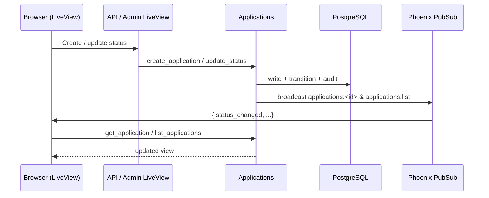

# 04 — Web & API

This document covers the transport layer: routing, authentication, authorization, controllers, LiveViews, real-time updates, pagination, and the webhook receiver.

---

## 1. Router & Pipelines

**File:** `lib/debt_stalker_web/router.ex`

Two main pipelines are defined:

### `:browser` pipeline

```elixir
pipeline :browser do
  plug :accepts, ["html"]
  plug :fetch_session
  plug :fetch_live_flash
  plug :put_root_layout, html: {DebtStalkerWeb.Layouts, :root}
  plug DebtStalkerWeb.Plugs.SetLocale
  plug DebtStalkerWeb.Plugs.AssignRole
  plug :protect_from_forgery
  plug :put_secure_browser_headers
end
```

### `:api` pipeline

```elixir
pipeline :api do
  plug :accepts, ["json"]
end
```

### Routes

| Method | Path | Handler | Auth |
|--------|------|---------|------|
| GET | `/` | `PageController.home` | browser |
| GET/POST | `/admin/login` | `PageController.login/do_login` | browser |
| DELETE | `/admin/logout` | `PageController.logout` | browser |
| live | `/apply` | `Apply.ApplicationFormLive` | applicant role |
| live | `/apply/:id/confirmation` | `Apply.ApplicationConfirmationLive` | applicant role |
| live | `/admin` | `Admin.DashboardLive` | admin role |
| live | `/admin/applications` | `Admin.ApplicationsLive` | admin role |
| live | `/admin/applications/:id` | `Admin.ApplicationDetailLive` | admin role |
| GET | `/api/health` | `Api.HealthController.index` | public |
| GET | `/api/health/live` | `Api.HealthController.liveness` | public |
| GET | `/api/health/ready` | `Api.HealthController.readiness` | public |
| POST | `/api/auth/token` | `Api.AuthController.create` | public (rate-limited) |
| GET | `/api/applications` | `Api.ApplicationController.index` | JWT read |
| GET | `/api/applications/:id` | `Api.ApplicationController.show` | JWT read |
| POST | `/api/applications` | `Api.ApplicationController.create` | JWT update |
| PATCH | `/api/applications/:id/status` | `Api.ApplicationController.update_status` | JWT update |
| POST | `/api/webhooks/provider-confirmations` | `Api.WebhookController.receive_webhook` | HMAC (rate-limited) |

Dev-only routes (LiveDashboard, Swoosh mailbox) are mounted under `/dev` when `Application.compile_env(:debt_stalker, :dev_routes)` is true.

---

## 2. Authentication

### JWT tokens

**File:** `lib/debt_stalker_web/auth/token.ex`

Uses Joken with HS256 and a configurable secret:

- `generate_token/1` issues a token with a `"role"` claim (`"read"` or `"update"`).
- `verify_token/1` validates the token and returns claims.
- Default expiration is 3600 seconds.
- Dev/test use a hardcoded secret (`config/runtime.exs:171`); prod requires `JWT_SECRET`.

### Auth plug

**File:** `lib/debt_stalker_web/auth/auth_plug.ex`

Extracts `Authorization: Bearer <token>`, verifies it, and assigns `:current_role`. Returns `401` with JSON `{"error": "unauthorized"}` on failure.

### Role plug

**File:** `lib/debt_stalker_web/auth/require_role_plug.ex`

Halts with `403` unless the connection has the required role. The `"update"` role implies `"read"`:

```elixir
defp has_role?("update", _any), do: true
```

### LiveView role auth

**File:** `lib/debt_stalker_web/live/role_auth.ex`

`on_mount` hook enforces `:applicant`, `:admin`, or `:any` roles using the session set by `PageController.set_role/2`.

---

## 3. API Controllers

### ApplicationController

**File:** `lib/debt_stalker_web/controllers/api/application_controller.ex`

#### `index/2`

- Builds filters from query params: `country`, `status`, `date_from`, `date_to`, `limit`, `cursor`.
- Calls `Applications.list_applications/1` in cursor mode.
- Returns `%{data: [...], cursor: "..."}`.

#### `show/2`

- Calls `Applications.get_application/1`.
- Returns `%{data: serialize_application(app)}` or `404`.

#### `create/2`

- Parses params into a map with `Decimal` amounts.
- Calls `Applications.create_application/1`.
- On success returns `201` with the redacted application.
- On validation error returns `422` with `%{errors: ...}`.

#### `update_status/2`

- Calls `Applications.update_status(id, new_status, triggered_by)` where `triggered_by` is the current role.
- Maps results to `200`, `404`, `422`.

#### Serialization

```elixir
defp serialize_application(%CreditApplication{} = app) do
  %{
    id: app.id,
    country: app.country,
    full_name: app.full_name,                       # ← not redacted
    identity_document: CreditApplication.redact_document(app.identity_document),
    requested_amount: Decimal.to_string(app.requested_amount),
    monthly_income: Decimal.to_string(app.monthly_income),
    application_date: app.application_date,
    status: app.status,
    additional_review_required: app.additional_review_required,
    provider_summary: app.provider_summary,
    inserted_at: app.inserted_at
  }
end
```

The identity document is redacted, but `full_name` is returned verbatim — a PII gap.

### AuthController

**File:** `lib/debt_stalker_web/controllers/api/auth_controller.ex`

Issues a JWT for a requested role. Rate-limited by `DebtStalkerWeb.Plugs.RateLimit`.

### HealthController

**File:** `lib/debt_stalker_web/controllers/api/health_controller.ex`

- `/api/health` — legacy healthy response.
- `/api/health/live` — liveness probe (200 if BEAM is up).
- `/api/health/ready` — readiness probe (checks DB connectivity; 200 or 503).

---

## 4. LiveViews

### `Apply.ApplicationFormLive`

**File:** `lib/debt_stalker_web/live/apply/application_form_live.ex`

- Role: applicant.
- Mount: builds form, loads country options from `CountryRegistry.supported_countries/0`.
- `handle_event("validate", ...)` — client-side changeset validation using `CreditApplication.changeset/2` directly.
- `handle_event("save", ...)` — submits to `Applications.create_application/1` and redirects to confirmation.

### `Apply.ApplicationConfirmationLive`

**File:** `lib/debt_stalker_web/live/apply/application_confirmation_live.ex`

- Role: applicant.
- Subscribes to `applications:#{app.id}` for real-time status updates.
- Renders application summary with redacted identity document but full `full_name`.

### `Admin.ApplicationsLive`

**File:** `lib/debt_stalker_web/live/admin/applications_live.ex`

- Role: admin.
- Uses page-based pagination with filters and sortable columns.
- Subscribes to `applications:list` for real-time list updates.
- Highlights newly created/updated rows for 2 seconds.
- Renders `full_name` verbatim.

### `Admin.ApplicationDetailLive`

**File:** `lib/debt_stalker_web/live/admin/application_detail_live.ex`

- Role: admin.
- Shows application details, provider summary, audit timeline, and allowed status transitions.
- Subscribes to `applications:#{app.id}`.
- Manual status transitions call `Applications.update_status/3` with `"admin"` actor.
- Renders `full_name` verbatim.

### `Admin.DashboardLive`

**File:** `lib/debt_stalker_web/live/admin/dashboard_live.ex`

- Role: admin.
- Displays KPI cards, status/country breakdowns, timeline chart, and recent activity.
- Calls `Applications.dashboard_analytics/1`.

---

## 5. Real-Time PubSub Flow



Broadcast topics:

- `applications:list` — used by `ApplicationsLive`, `CacheInvalidator`.
- `applications:<id>` — used by `ApplicationConfirmationLive`, `ApplicationDetailLive`.

---

## 6. Pagination Strategy

The project uses two pagination strategies deliberately:

| Mode | Use case | Implementation |
|------|----------|----------------|
| **Cursor** | API list | Keyset on `(application_date, id)`; capped at 100 records; no `OFFSET` |
| **Page** | Admin UI | Bounded page-based with sortable columns; uses `OFFSET` for flexibility |

### Cursor pagination

`Applications.list_applications_by_cursor/1` (`lib/debt_stalker/applications.ex:465-494`):

- Default limit 20, max 100.
- Cursor is a Base64-encoded JSON object with `date` and `id`.
- Query uses `(application_date < date) OR (application_date == date AND id < id)`.
- Fetches `limit + 1` rows to detect whether a next page exists.

### Page pagination

`Applications.list_applications_by_page/1` (`lib/debt_stalker/applications.ex:496-520`):

- Default 20 per page, max 100.
- Supports `sort_by` and `sort_dir`.
- Computes `total_count` and `total_pages`.

---

## 7. Webhook Receiver

**File:** `lib/debt_stalker_web/controllers/api/webhook_controller.ex`

### Flow

1. `RawBodyReader` plug stores the raw request body in `conn.assigns[:raw_body]`.
2. `receive_webhook/2` verifies HMAC signature, checks idempotency, then stores and processes.
3. HMAC uses `:crypto.mac(:hmac, :sha256, webhook_secret, body)` compared with `Plug.Crypto.secure_compare/2`.
4. In dev/test, signature verification is optional (`require_webhook_signature?/0` returns `false`).
5. Idempotency is checked via `Notifications.webhook_event_exists?/1` using a SHA-256 hash of the params.

### Idempotency gap

`hash_payload/1` uses `Jason.encode!(params)`:

```elixir
:sha256 |> :crypto.hash(Jason.encode!(params)) |> Base.encode16(case: :lower)
```

JSON key order matters. A provider sending the same logical payload with reordered keys will produce a different hash and bypass deduplication. A canonical serialization (e.g., sort keys, or hash only stable fields) should be used.

### Optional `application_id`

The controller accepts webhooks without an `application_id` and returns `200 {"received": true}` without recording a `webhook_events` row. This is documented as "general provider messages" but means such messages are invisible to the audit trail.

---

## 8. Plugs

### Rate limiting

**File:** `lib/debt_stalker_web/plugs/rate_limit.ex`

Uses Hammer with an ETS backend. Configured in `config/config.exs:106-108`:

```elixir
config :debt_stalker, :rate_limit,
  auth_token: [limit: 10, window_ms: 60_000],
  webhook: [limit: 20, window_ms: 60_000]
```

Applied to `POST /api/auth/token` and `POST /api/webhooks/provider-confirmations`.

Client IP resolution prefers `X-Forwarded-For` leftmost value, falling back to `conn.remote_ip`. This trusts the header without validating a trusted proxy chain.

### SetLocale

**File:** `lib/debt_stalker_web/plugs/set_locale.ex`

Hardcodes the locale to `"es"` for Gettext.

### AssignRole

**File:** `lib/debt_stalker_web/plugs/assign_role.ex`

Reads the browser persona role from the session and assigns it.

### RawBodyReader

**File:** `lib/debt_stalker_web/plugs/raw_body_reader.ex`

Preserves the raw request body so the webhook controller can verify HMAC signatures after Phoenix parsers have consumed the body.

---

## 9. Web Layer Gaps

| # | Issue | Severity | Evidence |
|---|-------|----------|----------|
| 1 | **Full name is not redacted** in API responses or LiveViews | High (contract/PII) | `ApplicationController.serialize_application/1` returns `full_name: app.full_name` (`lib/debt_stalker_web/controllers/api/application_controller.ex:155`). `ApplicationConfirmationLive` (`:120`), `ApplicationsLive` (`:179`), and `ApplicationDetailLive` (`:118`) render `app.full_name` directly. |
| 2 | **Web layer reaches into internal modules** | Medium | `ApplicationFormLive`, `ApplicationsLive`, and `DashboardLive` call `CountryRegistry.supported_countries/0` directly. Controllers call `CreditApplication.redact_document/1` directly. |
| 3 | **LiveView callbacks lack `@spec`** | Low/Medium | `ApplicationFormLive.handle_event("save", ...)` (`:61`), `ApplicationsLive` handlers (`:88, :99, :106, :110, :114, :118`), `DashboardLive` handlers. |
| 4 | **Webhook hash is order-sensitive** | Medium | `WebhookController.hash_payload/1` uses `Jason.encode!(params)` (`lib/debt_stalker_web/controllers/api/webhook_controller.ex:139`). |
| 5 | **Rate-limit client IP trusts X-Forwarded-For** | Medium | `RateLimit.get_client_ip/1` takes leftmost value without proxy validation (`lib/debt_stalker_web/plugs/rate_limit.ex:66-73`). |
| 6 | **SetLocale hardcodes Spanish** | Low | `lib/debt_stalker_web/plugs/set_locale.ex:10` ignores `Accept-Language`. |
| 7 | **ErrorJSON/ErrorHTML remain generic** | Low | Minimal custom payloads beyond controller-specific ones. |

---

## 10. API Quick Reference

See `README.md` and `docs/postman/debt-stalker.json` for runnable examples.

```bash
# Health
curl http://localhost:4000/api/health

# Token
curl -X POST http://localhost:4000/api/auth/token \
  -H 'Content-Type: application/json' \
  -d '{"role":"update"}'

# Create application
curl -X POST http://localhost:4000/api/applications \
  -H 'Authorization: Bearer <token>' \
  -H 'Content-Type: application/json' \
  -d '{"country":"ES","full_name":"Juan Garcia","identity_document":"12345678Z","requested_amount":"5000","monthly_income":"2000"}'

# List with cursor
curl "http://localhost:4000/api/applications?limit=10" \
  -H 'Authorization: Bearer <token>'

# Update status
curl -X PATCH http://localhost:4000/api/applications/<id>/status \
  -H 'Authorization: Bearer <token>' \
  -H 'Content-Type: application/json' \
  -d '{"status":"approved"}'

# Webhook
curl -X POST http://localhost:4000/api/webhooks/provider-confirmations \
  -H 'Content-Type: application/json' \
  -H 'x-webhook-signature: <hmac>' \
  -d '{"application_id":"<id>","status":"approved","source":"provider_es"}'
```
