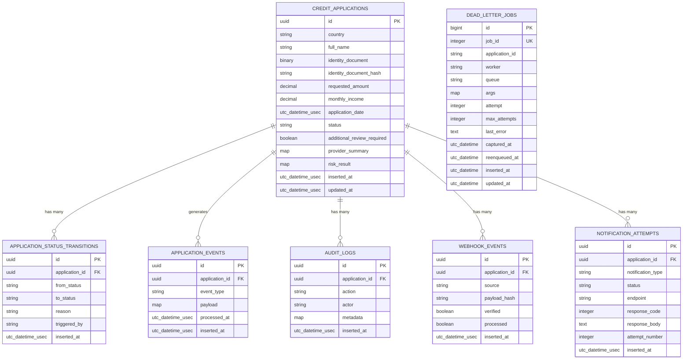

# 05 — Data & Persistence

This document describes the PostgreSQL data model, migrations, triggers, indexes, Cloak encryption, and query strategies used by Debt Stalker.

---

## 1. Database Tables



---

## 2. Migrations

### `20260620220700_create_credit_applications.exs`

Creates the core table with:

- `id` as `:binary_id` primary key.
- Encrypted `identity_document` stored as `:binary`.
- `identity_document_hash` as `:string` for lookup.
- `requested_amount` and `monthly_income` as `:decimal`.
- `application_date` as `:utc_datetime_usec`, server-set.
- Indexes:
  - `(country, status, application_date)` — core list/filter queries.
  - `(application_date)` — date-range and cursor pagination.
  - `(identity_document_hash)` — encrypted document lookup.

### `20260620220833_create_supporting_tables.exs`

Creates:

- `application_status_transitions` — every valid status change.
- `application_events` — outbox table with `event_type`, `payload`, `processed_at`.
- `audit_logs` — append-only audit trail.
- `webhook_events` — inbound webhook metadata (initially included `raw_payload`).
- `notification_attempts` — outbound notification attempts.

### `20260620220901_add_outbox_triggers.exs`

Defines two trigger functions:

- `fn_application_created_event()` → `trg_application_created` on `AFTER INSERT`.
- `fn_application_status_changed_event()` → `trg_application_status_changed` on `AFTER UPDATE OF status`.

Both insert rows into `application_events`. The status-change trigger uses `IS DISTINCT FROM` to avoid emitting events when the status did not change.

### `20260621062500_create_dead_letter_jobs.exs`

Creates the DLQ table with a unique index on `job_id` for idempotent capture.

### `20260621070000_add_reenqueued_at_to_dead_letter_jobs.exs`

Adds `reenqueued_at` to prevent duplicate replays.

### `20260622050000_remove_raw_payload_from_webhook_events.exs`

Removes `raw_payload` from `webhook_events`, enforcing the invariant that raw provider payloads are never persisted.

### `20260622073243_add_unprocessed_application_events_depth_index.exs`

Creates a partial index:

```sql
CREATE INDEX application_events_unprocessed_inserted_at_idx
  ON application_events (inserted_at)
  WHERE processed_at IS NULL;
```

This accelerates the dispatcher's `WHERE processed_at IS NULL` query. It is created `concurrently` with DDL transactions disabled.

---

## 3. Cloak Encryption at Rest

### Vault configuration

**File:** `lib/debt_stalker/vault.ex`

Configures Cloak with AES-256-GCM. In production, the key is loaded from the `CLOAK_KEY` env var (`config/runtime.exs:96-109`):

```elixir
config :debt_stalker, DebtStalker.Vault,
  ciphers: [
    default: {
      Cloak.Ciphers.AES.GCM,
      tag: "AES.GCM.V1", key: Base.decode64!(cloak_key), iv_length: 12
    }
  ]
```

### Encrypted field

**File:** `lib/debt_stalker/applications/credit_application.ex:22`

```elixir
field :identity_document, DebtStalker.Vault.EncryptedBinary
```

### Hash for lookup

Because the encrypted value cannot be queried, a SHA-256 hash is computed automatically in the changeset:

```elixir
|> put_identity_document_hash()
```

Hash implementation (`lib/debt_stalker/applications/credit_application.ex:85-87`):

```elixir
def hash_document(document) do
  :crypto.hash(:sha256, document) |> Base.encode16(case: :lower)
end
```

This allows deduplication/lookup by document without decrypting every row.

---

## 4. Query Strategy

### Filtered base query

`Applications.filtered_query/1` (`lib/debt_stalker/applications.ex:575-580`) composes optional filters:

```elixir
CreditApplication
|> maybe_filter_country(filters)
|> maybe_filter_status(filters)
|> maybe_filter_date_range(filters)
```

### Cursor pagination query

```elixir
filters
|> filtered_query()
|> apply_sort(%{sort_by: "application_date", sort_dir: "desc"})
|> maybe_apply_cursor(filters)
|> limit(^(limit + 1))
```

The cursor encodes `(application_date, id)` and the where clause is:

```elixir
a.application_date < ^date or
  (a.application_date == ^date and a.id < ^id)
```

### Page pagination query

```elixir
base_query = filtered_query(filters) |> apply_sort(filters)
total_count = Repo.aggregate(base_query, :count, :id)
entries =
  base_query
  |> limit(^per_page)
  |> offset(^offset)
  |> Repo.all()
```

### Sorting

`apply_sort/2` supports `full_name`, `requested_amount`, `country`, `status`, and `application_date`, each with a tie-breaker on `id` (`lib/debt_stalker/applications.ex:642-665`).

---

## 5. Transaction Boundaries

### Application creation (success path)

`create_application/1` uses a simple `Repo.insert()` because the outbox trigger guarantees async event creation in the same transaction.

### Status update

`perform_status_update/3` uses `Ecto.Multi` to atomically:

1. Update the application status.
2. Insert a status transition row.
3. Insert an audit log row.

If any step fails, the whole transaction rolls back (`lib/debt_stalker/applications.ex:237-300`).

### Provider-error creation

When provider enrichment fails, `create_application/1` inserts the application with status `"provider_error"` and records a transition + audit log in a single `Ecto.Multi` (`lib/debt_stalker/applications.ex:101-167`).

### Gap in provider-error transition

The transition is recorded as `from_status: "created"`:

```elixir
%{
  application_id: app.id,
  from_status: "created",
  to_status: "provider_error",
  triggered_by: "provider"
}
```

`"created"` is not in `CreditApplication.valid_statuses/0`, so this transition record references a non-existent status.

---

## 6. Index Strategy

| Index | Migration | Purpose |
|-------|-----------|---------|
| `(country, status, application_date)` | `create_credit_applications` | Filtered list queries |
| `(application_date)` | `create_credit_applications` | Date range + cursor pagination |
| `(identity_document_hash)` | `create_credit_applications` | Encrypted document lookup |
| `(application_id)` on `application_status_transitions` | `create_supporting_tables` | Transition history per app |
| `(application_id)` on `application_events` | `create_supporting_tables` | Outbox events per app |
| `(processed_at, inserted_at)` → dropped | `create_supporting_tables` / `add_unprocessed_application_events_depth_index` | Replaced by partial index |
| `application_events_unprocessed_inserted_at_idx` | `add_unprocessed_application_events_depth_index` | Fast dispatcher claims |
| `(application_id)` on `audit_logs` | `create_supporting_tables` | Audit trail per app |
| unique `(payload_hash)` on `webhook_events` | `create_supporting_tables` | Webhook idempotency |
| `(application_id)` on `webhook_events` | `create_supporting_tables` | Webhook history per app |
| `(application_id)` on `notification_attempts` | `create_supporting_tables` | Notification history per app |
| unique `(job_id)` on `dead_letter_jobs` | `create_dead_letter_jobs` | Idempotent DLQ capture |

---

## 7. Data Layer Gaps

| # | Issue | Severity | Evidence |
|---|-------|----------|----------|
| 1 | **Invalid `from_status` in provider-error transition** | Medium | `lib/debt_stalker/applications.ex:111` uses `"created"`, not in `@valid_statuses`. |
| 2 | **Webhook idempotency hash is order-sensitive** | Medium | `lib/debt_stalker_web/controllers/api/webhook_controller.ex:139` hashes `Jason.encode!(params)`. |
| 3 | **Audit synchronous in transition transaction** | Medium | `lib/debt_stalker/applications.ex:251-261` writes audit inside the status-update multi. |
| 4 | **No partial index on `processed_at IS NULL` for webhook_events** | Low | `webhook_events.processed` is queried broadly without a partial index. |
| 5 | **DLQ `reenqueued_at` migration is separate** | Low | Two migrations for the same table; harmless but could be consolidated. |

---

## 8. Future Scale Plan

The README and master-plan document the following scale improvements for Phase 4:

- **Range partition `credit_applications` by `application_date`** (e.g., monthly ranges).
- **Read replicas** for list/detail queries; writes stay on primary.
- **Archiving** old `audit_logs` and `notification_attempts` to cold storage.
- **Admin search** moves to sort-specific keyset pagination or indexed search.
- **Dashboard analytics** moves to daily rollups or materialized stats.

These are not implemented today but the query patterns (cursor pagination, composite indexes, country/status filtering) are designed to support them.
