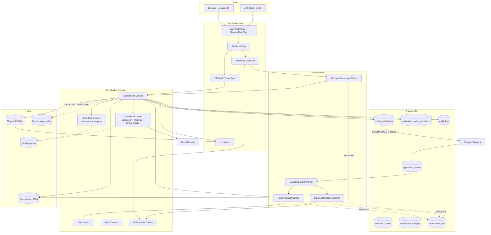

# Debt Stalker — Deep Analysis

> **Purpose:** This document set is a 100% structural, methodological, and architectural analysis of the Debt Stalker codebase. It is aimed at senior engineers who need to understand how the project is organized, what patterns it uses, what has been implemented well, and where the real gaps are.
>
> **Scope:** The analysis covers the code as it exists today (Phases 0–2 delivered, ES + MX vertical slice, production-hardening primitives in place). It does not propose new features; it documents the existing system and identifies risks/gaps.
>
> **How to read:** Start with this file for the big picture, then dive into the topic files below. Each file contains concrete code references and Mermaid diagrams.

---

## Executive Summary

Debt Stalker is a **multi-country credit-application core** for a fintech operating in six countries (ES, PT, IT, MX, CO, BR). The current MVP implements a complete vertical slice for **Spain (ES)** and **Mexico (MX)** behind clean, extensible abstractions.

It is built as a **single Elixir/Phoenix application** (not an umbrella) with:

- **Phoenix 1.8** + **LiveView 1.2** for the web/API layer.
- **PostgreSQL 16** for persistence, with Postgres triggers driving an outbox table.
- **Oban** for durable background jobs.
- **Cloak Ecto** for AES-256-GCM encryption of identity documents at rest.
- **Cachex** for application detail caching, invalidated via PubSub.
- **Prometheus/Telemetry** for operational metrics.
- **JWT (Joken)** for API authentication and **role-based plugs** for authorization.

The project follows a strict **code-organization contract**: domain contexts (`DebtStalker.Applications`, `Countries`, `Providers`, `Risk`, `Audit`, `Notifications`) own business rules; the web layer (`DebtStalkerWeb`) owns transport, auth, serialization, and UI; workers delegate to contexts. Country/provider branching is forbidden outside `DebtStalker.Countries` and `DebtStalker.Providers`, and is enforced by custom Credo checks.

### What has been done well

1. **Clean architecture.** Behaviours + ETS registries isolate country/provider rules; web layer only calls context public APIs.
2. **Production-grade async backbone.** Postgres triggers write to `application_events`; `EventDispatcherWorker` claims batches with `FOR UPDATE SKIP LOCKED`; specialized Oban workers are idempotent.
3. **Security-first PII handling.** `identity_document` is encrypted at rest, hashed for lookup, and redacted to last-4 in API/UI/logs.
4. **Resilience primitives.** Per-provider circuit breakers with retry budgets, dead-letter queue for exhausted jobs, rate limiting, and PubSub-driven cache invalidation.
5. **Observability.** Structured JSON logging, custom telemetry feeding Prometheus, outbox lag metrics, cache hit/miss metrics.
6. **Quality discipline.** Strict Credo, Dialyzer, 85% coverage gate, custom architecture checks, CI with k8s dry-run and secret scanning.
7. **Scale-ready design.** API cursor pagination, composite indexes, web/worker split in k8s, documented Phase 4 partitioning/replica plans.

### Headline gaps

1. **Full-name redaction is implemented but unused.** `CreditApplication.redact_full_name/1` exists, but the API and LiveViews return/render `full_name` verbatim, violating the logging contract.
2. **Webhook idempotency hash is order-sensitive.** `Jason.encode!(params)` produces different hashes for the same logical payload with reordered keys.
3. **Provider-error creation records a non-existent status.** `create_application/1` records a transition `from_status: "created"`, but `"created"` is not a valid status.
4. **k8s manifests have operational issues.** The migration `Job` has a fixed name (re-applying fails), the secret manifest is missing required keys, and deployments use a mutable `:latest` tag.
5. **Mox is declared but unused.** Provider tests rely on deterministic simulated adapters instead of the behaviour mock mandated by the testing strategy.
6. **Audit writes are synchronous in `Applications.update_status/3`.** This contradicts the original async `AuditWorker` concept and couples audit latency to every transition.

The full gap register with severity, evidence, and recommended fixes is in [`08-gaps-and-recommendations.md`](08-gaps-and-recommendations.md).

---

## System Architecture

---

## Document Map

| File | Focus |
|------|-------|
| [`01-methodology-and-conventions.md`](01-methodology-and-conventions.md) | Repo layout, AGENTS.md contract, TDD policy, review loop, error-handling/logging strategy. |
| [`02-domain-and-business-logic.md`](02-domain-and-business-logic.md) | Domain contexts, schemas, status machine, country/provider behaviours, ES/MX rules, PII handling. |
| [`03-async-and-resilience.md`](03-async-and-resilience.md) | Outbox pattern, workers, dispatcher, circuit breakers, DLQ, cache invalidation, telemetry. |
| [`04-web-and-api.md`](04-web-and-api.md) | Router, auth, controllers, LiveViews, components, pagination, real-time flow, webhooks. |
| [`05-data-and-persistence.md`](05-data-and-persistence.md) | Tables, migrations, triggers, indexes, Cloak encryption, pagination query strategy. |
| [`06-testing-and-quality.md`](06-testing-and-quality.md) | Test harness, custom Credo checks, Dialyzer, coverage, CI/CD, review bots. |
| [`07-deployment-and-operations.md`](07-deployment-and-operations.md) | Dockerfile, k8s, release tasks, runtime config, env vars, probes, ops gaps. |
| [`08-gaps-and-recommendations.md`](08-gaps-and-recommendations.md) | Consolidated risk/gap register, quick wins, prioritized backlog. |

---

## Quality Scorecard

| Area | Grade | Notes |
|------|-------|-------|
| Architecture / Separation of Concerns | A | Behaviour + registry pattern is clean and extensible. Minor web-layer drift (direct registry/schema access). |
| Security / PII | B+ | Encryption, hash, redaction of documents is excellent. Full-name redaction is missing in responses. |
| Async / Resilience | A- | Outbox + SKIP LOCKED + idempotent workers is solid. Audit is synchronous; webhook not routed through outbox. |
| Web / API | B+ | Good auth, rate limiting, pagination strategy. Webhook hash stability issue, full name exposed. |
| Data / Persistence | A | Well-indexed, Cloak encryption, triggers. Provider-error transition uses invalid status. |
| Testing / Quality | A- | Broad coverage, custom Credo checks. Mox unused, some `async: false` coupling. |
| Deployment / Ops | B | Manifests exist and web/worker split is correct. Fixed-name migration job, missing secrets, `:latest` tag. |
| Documentation | A | README, AGENTS.md, master-plan, ADRs, handoffs are thorough and current. |

---

## Critical Path in One Paragraph

A client creates an application via `POST /api/applications` or the `/apply` LiveView. `DebtStalker.Applications.create_application/1` resolves the country, validates the document and financials, fetches a normalized provider summary through a circuit breaker, and inserts a `credit_applications` row with status `"submitted"`. A Postgres trigger writes an `application.created` event to `application_events`. The cron-driven `EventDispatcherWorker` claims the event with `FOR UPDATE SKIP LOCKED` and enqueues a `RiskEvaluationWorker`. That worker moves the status through `"pending_risk"` to `"approved"`, `"rejected"`, or `"additional_review"` via `Applications.update_status/3`, which records the transition, audit log, broadcasts PubSub events, and invalidates Cachex. LiveViews subscribed to `applications:<id>` and `applications:list` update in near real time. Terminal statuses enqueue `ExternalNotificationWorker`; inbound webhooks enqueue `WebhookProcessingWorker`.
