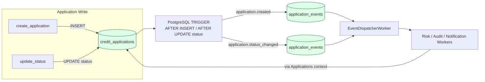

# Debt Stalker — Data Model (Global + Phase 1)

This document defines the core data model. It must be respected by any implementation.

Derived from `docs/v1/spec.md` (primary) and `docs/spec.md`.

## Core Principle
The data model supports the Global Architecture: country and provider knowledge stay outside the persistence layer as much as possible. The model itself is mostly country-agnostic.

## Primary Tables (Required for Phase 1)

### credit_applications
Central entity.

Key fields (minimum):
- `id` — UUID (binary_id)
- `country` — string (constrained to supported countries: "ES", "MX" in Phase 1)
- `full_name`
- `identity_document` (or encrypted variant) — stored for MVP; **never** logged in full
- `identity_document_hash` — for safe lookup/auditing
- `requested_amount` — decimal
- `monthly_income` — decimal
- `application_date` — UTC datetime (server-set)
- `status` — string (see status list in phase-1-acceptance.md)
- `additional_review_required` — boolean
- `provider_summary` — JSONB (only normalized, safe fields)
- `risk_result` — JSONB (controlled exposure)
- `inserted_at`, `updated_at`

### application_status_transitions
Audit of every status change.

Fields:
- `id`
- `application_id` (FK)
- `from_status`
- `to_status`
- `reason` (optional)
- `actor_type`, `actor_id`
- `inserted_at`

### application_events (Outbox — Critical)
Populated by PostgreSQL triggers.

Fields:
- `id`
- `application_id`
- `event_type` (e.g. "application.created", "application.status_changed")
- `payload` — JSONB
- `processed_at`
- `attempt_count`
- timestamps

**Triggers** on `credit_applications`:
- After INSERT → "application.created"
- After UPDATE of `status` → "application.status_changed"

### Supporting Tables
- `audit_logs` — append-only, redacted records of important events
- `webhook_events` — received webhooks, verification result, processing outcome
- `notification_attempts` — attempts to notify external systems

## Indexes (Phase 1 Minimum)
- `(country, status, application_date)`
- `(application_date)`
- On foreign keys
- `identity_document_hash`
- `application_events(processed_at, inserted_at)`

## Scaling Considerations (Documented in README)
- Cursor-based listing (keyset pagination)
- Range partitioning by `application_date` for large volumes
- Archiving strategy for old audit/notification rows

## Normalization Rules
- `provider_summary` contains **only** normalized fields (existing_debt, score_bucket, etc.).
- Never store raw provider payloads in this table.

## PII Handling
- `identity_document` may be stored (plain or encrypted in Phase 1).
- Always store `identity_document_hash`.
- Full values are redacted in all API responses, logs, and most internal processing.

## Outbox & Event Pattern

See `global-architecture.md` for full visual flows.

### Data & Trigger Flow (Simplified)

**Key Points:**
- Triggers are the **only** source of `application_events` for core lifecycle changes.
- Workers never bypass the `Applications` context.
- Events carry enough `payload` to be processed idempotently.

This model is intentionally minimal yet sufficient to support all six countries and future evolution.
