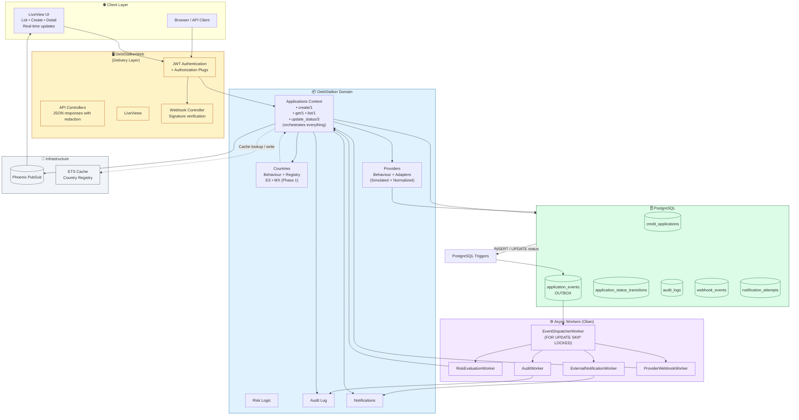
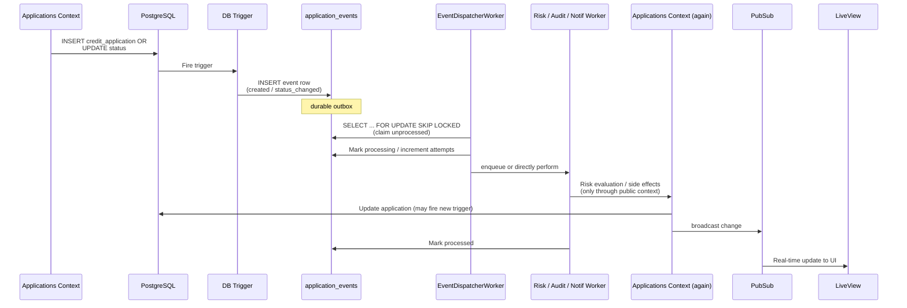

# Debt Stalker — Global Architecture

This is the single source of truth for the entire system design (all phases).

Extracted and refined from the master plan (docs/grok/plan.md).

## Core Domain Concepts (Glossary)

- Credit Application
- Country Module
- Provider Adapter (always normalized)
- Database-Generated Work (PostgreSQL triggers → application_events outbox)
- Async Boundary + Realtime Surface

## Modular Structure + Invariants

See the **Architecture Diagrams** section below for visual overviews of components, responsibilities, and data flows.

**Invariants (never violate):**
- No web code contains country or provider rules.
- Raw provider payloads never persist or leak.
- All status changes go through one audited transition path + broadcast.
- Lists are always cursor-paginated.

## Responsibility Matrix
| Layer      | Owns                                      | Must NOT |
|------------|-------------------------------------------|----------|
| Countries  | Validation, rules, transitions            | DB, web  |
| Providers  | Fetch + normalize only                    | Decisions|
| Applications | Lifecycle + coordination                | Rules    |
| Workers    | Reliable processing of events             | Rules    |
| Web        | Transport, auth, presentation, realtime   | Domain   |

## Country Behaviour (The Key Contract)
Callbacks defined in the master plan.

**Phase 1 rules (ES + MX)** — exact as in docs/spec.md + v1/spec.md.

Adding a country = implement behaviour + register. Zero other changes.

## Provider Behaviour
Normalization contract only. Simulated in Phase 1.

## Data Model + Async Flow (Critical)
Tables: credit_applications, application_events (outbox via trigger), transitions, audit, etc.

The required pattern:
Write → trigger → event row → worker claims (SKIP LOCKED) → Oban job(s) → context update + broadcast.

## Other Global Aspects
- API surface (JWT, cursor lists, webhooks)
- LiveView realtime
- Security & redaction
- Caching (ETS for registry)
- Observability
- Deployment (k8s manifests, Makefile)

Full details + rationale are in the master `plan.md`, `decisions.md`, and `risks.md`.

**Phase 1 must implement this architecture for ES + MX** while satisfying every criterion in `phase-1-acceptance.md`.

This architecture makes the other 4 countries and future evolution additive.

---

## Architecture Diagrams

### 1. High-Level Component Architecture & Responsibility Boundaries

This diagram shows the major layers and how the **Responsibility Matrix** is enforced in the system.



### 2. End-to-End Application Lifecycle Data Flow

This shows the main happy path for creating an application and how async processing + realtime updates occur.

```mermaid
flowchart TD
    Start([Create Request<br/>API or LiveView Form]) --> ValidateInput[Validate basic input]

    ValidateInput --> CountryVal[Country Validation<br/>Document + Financial Rules<br/>via Countries.ES / .MX]
    CountryVal -->|Invalid| Error1[Return 422 + errors]
    CountryVal -->|Valid| ProviderCall[Call Provider Adapter<br/>ESAdapter / MXAdapter]

    ProviderCall --> Normalize[Normalize Response<br/>into ProviderSummary]
    Normalize --> Persist[Persist credit_application<br/>with status=submitted<br/>+ provider_summary JSONB]

    Persist --> Trigger1[PostgreSQL Trigger<br/>INSERT → application.created]
    Trigger1 --> Outbox[(application_events)]

    Persist --> ReturnSuccess[Return success<br/>with application ID]

    Outbox --> Dispatcher[EventDispatcherWorker<br/>claims with SKIP LOCKED]

    Dispatcher --> RiskWorker[RiskEvaluationWorker]
    RiskWorker --> ReEval[Re-evaluate using<br/>Countries + ProviderSummary]
    ReEval --> Decide[Decide next status<br/>pending_risk → approved / rejected / additional_review]

    Decide --> UpdateStatus[Applications.update_status<br/>Validate transition<br/>Record transition<br/>Write audit_log]

    UpdateStatus --> Trigger2[PostgreSQL Trigger<br/>status change → application.status_changed]
    Trigger2 --> Outbox

    UpdateStatus --> Broadcast[PubSub broadcast<br/>applications:{id}]

    Broadcast --> UIUpdate[LiveView updates in real-time<br/>No page refresh]

    %% Side effects
    UpdateStatus --> NotifJob[Enqueue ExternalNotificationWorker]
    NotifJob --> Simulate[Simulate external notification<br/>or call configured endpoint]

    UpdateStatus --> AuditLog[Append to audit_logs]

    classDef start fill:#22c55e,stroke:#166534,color:#fff
    classDef error fill:#ef4444,stroke:#991b1b,color:#fff
    classDef process fill:#3b82f6,stroke:#1e40af,color:#fff
    classDef dbop fill:#8b5cf6,stroke:#4c1d95,color:#fff
    classDef ui fill:#f59e0b,stroke:#92400e,color:#fff

    class Start start
    class Error1 error
    class ValidateInput,CountryVal,ProviderCall,Normalize,Persist,RiskWorker,ReEval,Decide,UpdateStatus,NotifJob,Simulate process
    class Trigger1,Trigger2,Outbox,Broadcast,AuditLog dbop
    class UIUpdate ui
```

### 3. Async Outbox + Worker Processing Detail

Focus on the database-generated async requirement.



### How to Use These Diagrams

- Use the **Component Architecture** diagram when explaining boundaries and the Responsibility Matrix to new team members.
- Use the **Lifecycle Flow** to walk through a complete application journey (including async and realtime).
- Use the **Sequence Diagram** to discuss the critical "database operation generates async work" requirement from the original challenge.

These diagrams are intended to be living documentation — update them as the design evolves.

**Next steps before implementation:** Review these diagrams against the Responsibility Matrix, Data Model, and `phase-1-acceptance.md`.
