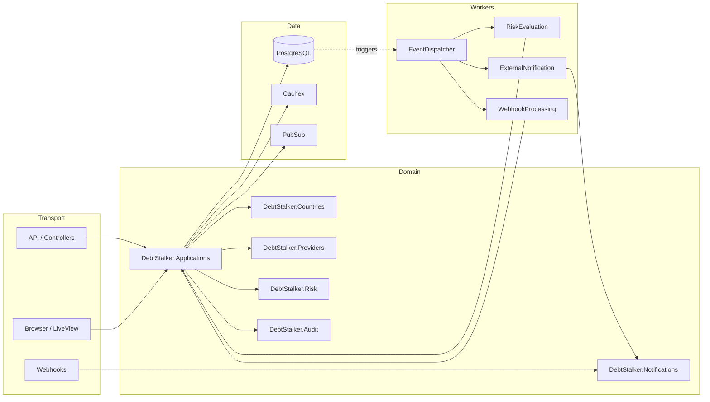

# Senior Engineer Interview Guide — Debt Stalker

This guide is for a senior engineer joining Debt Stalker who is new to Elixir. It explains how the app works, why it is built the way it is, and the common talking points you will encounter.

## 1. Elevator pitch

Debt Stalker is a multi-country credit-application core for a fintech operating in Spain, Portugal, Italy, Mexico, Colombia, and Brazil. In its current form it implements **Spain (ES) and Mexico (MX)** end-to-end. Applicants submit a credit request; the system validates the identity document, fetches a normalized credit-bureau/provider summary, evaluates risk, and moves the application through statuses. Admins can list, filter, and update applications in real time via a Phoenix LiveView dashboard.

The stack is **Elixir 1.18 / Phoenix 1.8 / PostgreSQL / Oban / LiveView**. The architecture is intentionally modular: country-specific rules live behind a behaviour, providers are adapter-based, and status changes are handled through an async Postgres outbox pattern.

## 2. High-level architecture

## 3. Request walkthrough

### 3.1 Applicant submits via LiveView

1. `Apply.ApplicationFormLive` collects country, full name, identity document, requested amount, and monthly income.
2. The country select drives the document hint via `DebtStalker.Countries.get_document_hint/1`.
3. On submit, the LiveView calls `DebtStalker.Applications.create_application/1`.
4. The context validates the identity document through the country module, validates financials, and calls `DebtStalker.Providers` through the circuit breaker.
5. The provider adapter (simulated for ES/MX) returns a normalized `provider_summary`.
6. The application is inserted into PostgreSQL. Database triggers write a `application.created` event into the `application_events` outbox table.
7. `DebtStalker.PubSub` broadcasts the creation to the admin dashboard and list.
8. The applicant is redirected to `Apply.ApplicationConfirmationLive`, which subscribes to the per-application topic and shows live status updates.

### 3.2 Oban worker processes the outbox

1. Every minute, the Cron plugin enqueues `EventDispatcherWorker`.
2. The dispatcher uses `FOR UPDATE SKIP LOCKED` to grab unprocessed `application_events` rows.
3. For each event, it inserts a specialized job: `RiskEvaluationWorker`, `ExternalNotificationWorker`, or `WebhookProcessingWorker`.
4. `RiskEvaluationWorker` loads the application, fetches provider data, evaluates risk, and calls `Applications.update_status/3` to move the application forward.

### 3.3 Admin updates status

1. `Admin.ApplicationDetailLive` renders the status transition form.
2. On submit, it calls `Applications.update_status/3` with `"admin"` as the actor.
3. The context validates the transition against the country module, inserts a `StatusTransition` row, writes an `AuditLog`, updates the application, and broadcasts a `:status_changed` event.
4. The admin list and the applicant confirmation page both refresh automatically because they are subscribed to PubSub topics.

### 3.4 Provider pushes a webhook

1. `POST /api/webhooks/provider-confirmations` reaches `Api.WebhookController`.
2. `RawBodyReader` has preserved the original request body, so the controller verifies the HMAC-SHA256 signature.
3. The payload hash is checked against `WebhookEvent` records for idempotency.
4. A `WebhookEvent` is recorded via `Notifications`, and a `WebhookProcessingWorker` is enqueued.
5. The worker applies the status transition and marks the event as processed.

## 4. Key technical decisions and why

### 4.1 Behaviours + registry for countries and providers

- **Decision:** Every country and provider implements a `Behaviour` and is registered at boot in an ETS-backed registry.
- **Why:** The codebase is multi-country. Adding a country means adding a module and registering it, not scattering `if country == "ES"` through the app. This enforces the project rule that only `DebtStalker.Countries` and `DebtStalker.Providers` contain country/provider branching.

### 4.2 Postgres outbox for async work

- **Decision:** Database triggers on `credit_applications` insert events into `application_events`. A dispatcher worker drains the table and enqueues specialized Oban jobs.
- **Why:** It keeps the web request synchronous and fast, while guaranteeing that every event is processed at least once. The outbox is inside the same database transaction as the application change, so we do not lose events on failure.

### 4.3 Synchronous audit logging

- **Decision:** Audit logs are written in the same transaction as status updates (see `ADR-0004`).
- **Why:** The original design planned an `AuditWorker`, but the team wanted stronger guarantees: the audit record must exist if the status change committed. Synchronous audit is simpler and durable, while async risk and notification remain fast.

### 4.4 ETS-backed country/provider registry

- **Decision:** The registry loads modules into a private ETS table at startup.
- **Why:** O(1) lookups at runtime, and the registry is the single source of truth for supported countries. Adding a country only requires registering the module; the rest of the app does not change.

### 4.5 PII encryption with Cloak

- **Decision:** `identity_document` is encrypted at rest using AES-256-GCM via `cloak_ecto`. The database stores only `identity_document_hash` for lookups.
- **Why:** Identity documents are the most sensitive PII. Encryption limits exposure if the database is compromised. Hashes allow deduplication without decrypting.

### 4.6 Circuit breakers for provider calls

- **Decision:** A custom `CircuitBreaker` GenServer guards provider calls with closed/open/half-open states and a retry budget.
- **Why:** Provider failures must not cascade. The breaker fails fast when the provider is unhealthy, avoids thundering herds, and probes recovery automatically. A custom breaker was chosen over an external library to keep the dependency surface small and the telemetry uniform.

### 4.7 Rate limiting

- **Decision:** `Hammer` with an ETS backend limits token generation and webhook ingestion per IP.
- **Why:** Cheap, in-memory rate limiting that does not require a separate Redis cluster. The limits are configurable per environment.

### 4.8 Cursor and offset pagination

- **Decision:** The admin list uses offset pagination (page/per_page); the dashboard uses cursor pagination for "load more".
- **Why:** Offset pagination is easier for admin users who need to jump to a specific page and share URLs. Cursor pagination is more efficient for large, append-only streams like the dashboard's recent list.

### 4.9 Simulated providers

- **Decision:** The provider adapters are deterministic simulators based on identity document prefixes.
- **Why:** The challenge focuses on architecture and integration patterns, not negotiating real credit-bureau contracts. A real provider would implement the same `DebtStalker.Providers.Behaviour` without touching the rest of the app.

## 5. Trade-offs and alternatives

### 5.1 Behaviours vs. `cond` or a rules database

- **Chosen:** Behaviours + registry.
- **Alternative:** Store rules in the database and evaluate them at runtime.
- **Trade-off:** Behaviours are simpler, testable, and compile-time checked. A database rules engine is more flexible for non-engineers but adds complexity and latency. For a small number of countries, behaviours are the right default.

### 5.2 Oban vs. a custom job queue

- **Chosen:** Oban (Postgres-backed).
- **Alternative:** RabbitMQ, Redis, or a custom queue.
- **Trade-off:** Oban reuses the existing database, gives us reliable retries, scheduling, and a built-in Web UI, and integrates cleanly with Ecto. The downside is a small amount of extra write load on Postgres.

### 5.3 PubSub vs. polling

- **Chosen:** Phoenix.PubSub for real-time UI updates.
- **Alternative:** The browser polls the API every few seconds.
- **Trade-off:** PubSub is immediate, scalable, and already provided by Phoenix. Polling is simpler to reason about but adds latency and load.

### 5.4 Custom circuit breaker vs. `fuse` or `breakex`

- **Chosen:** Custom `CircuitBreaker` GenServer.
- **Alternative:** Hex packages like `fuse` or `safari`.
- **Trade-off:** The custom breaker gives us exactly the semantics we need (half-open probe budget, telemetry tags, state reset API) and avoids an extra dependency. The cost is a module we must maintain.

### 5.5 Simulated vs. real providers

- **Chosen:** Simulated providers.
- **Alternative:** Real sandboxed credit-bureau APIs.
- **Trade-off:** Simulation lets us test the full flow without credentials, rate limits, or flaky third-party dependencies. The cost is that risk decisions are synthetic; a real deployment would swap the adapter module.

## 6. Folder tour

- `lib/debt_stalker/` — domain contexts. The heart of the app.
  - `applications/` — schemas, changesets, and the main lifecycle context.
  - `countries/` — behaviour, registry, and ES/MX implementations.
  - `providers/` — behaviour, adapters, circuit breaker, and registry.
  - `workers/` — Oban workers that drain the outbox.
  - `notifications/` — webhook and notification persistence.
  - `dead_letter/` — exhausted Oban job capture and replay.
  - `vault/` — Cloak encryption.
  - `seeds/` — demo data.
- `lib/debt_stalker_web/` — transport layer.
  - `auth/` — JWT and session role plugs.
  - `plugs/` — rate limiting, locale, raw body reader.
  - `controllers/` — page and API controllers.
  - `live/` — LiveViews for applicants and admins.
  - `components/` — shared UI, filters, charts, pagination.
  - `admin/` — URL filter parameter helpers.
- `priv/repo/migrations/` — schema evolution, including database triggers.
- `docs/` — requirements, master plan, ADRs, handoffs, and now this guide.
- `test/` — ExUnit, Mox, Oban.Testing, LiveView tests.

## 7. Elixir specifics for newcomers

### 7.1 Contexts

Phoenix contexts are boundary modules (e.g. `DebtStalker.Applications`) that group related schemas and functions. They are the public API of a domain area. The web layer and workers call contexts, not internal modules.

### 7.2 Behaviours

A behaviour is a contract (like an interface). `DebtStalker.Countries.Behaviour` defines callbacks such as `validate_document/1`. `ES` and `MX` implement those callbacks. The registry lets callers look up the right module at runtime.

### 7.3 Ecto schemas

Schemas define the shape of database tables and provide changesets for validation. `CreditApplication.changeset/2` is the canonical place for application validation. Encrypted fields use a custom Ecto type (`DebtStalker.Vault.EncryptedBinary`).

### 7.4 Oban workers

Workers are modules that implement `perform/1`. They are enqueued via `Oban.insert/1` or by the Cron plugin. Oban handles retries, backoff, and job state. We use `{:cancel, reason}` to stop retrying permanently failed jobs.

### 7.5 LiveView

LiveViews are processes that render HTML and keep state. They mount once, handle events from the browser, and re-render when state changes. PubSub messages are delivered to the LiveView process as `handle_info/2` calls.

### 7.6 PubSub

Phoenix.PubSub broadcasts messages to subscribers. We use the topic `applications:list` for global list updates and `applications:<id>` for per-application updates.

### 7.7 Telemetry

`:telemetry` is the event library used for metrics. `DebtStalkerWeb.Telemetry` defines metrics; `DebtStalker.ObanTelemetryHandler` captures job lifecycle events and feeds the DLQ.

### 7.8 Testing stack

- **ExUnit** — test framework.
- **Mox** — mocks for the country and provider behaviours (see `test/support/mocks.ex`).
- **Oban.Testing** — `assert_enqueued/1` and `perform_job/2` for worker tests.
- **Phoenix LiveView tests** — `live/2` and `render_submit/1` for UI interactions.
- **StreamData** — property-based tests for document validation.
- **Ecto sandbox** — transactional tests via `DataCase` and `ConnCase`.

## 8. Common interview questions and suggested answers

### Q: Why does the app use behaviours instead of conditionals for country logic?

**A:** The project rule forbids `if country == "ES"` outside the country and provider contexts. Behaviours enforce a consistent interface for every country and let the registry pick the right implementation at runtime. Adding a new country becomes "add a module and register it" instead of hunting through the codebase.

### Q: How does the system guarantee that a status change and its audit record are consistent?

**A:** They are committed in the same `Ecto.Multi` transaction. If any part fails, the whole transaction rolls back. We deliberately chose synchronous audit logging in `ADR-0004` because we never want an audit gap.

### Q: Why are providers simulated instead of real?

**A:** The challenge is about architecture and integration patterns, not real credit-bureau contracts. The simulated adapters implement the same behaviour as a real provider would, so the swap is isolated to `lib/debt_stalker/providers/`.

### Q: How does the real-time UI work?

**A:** The contexts broadcast `{:application_created, app}` and `{:status_changed, details}` on Phoenix.PubSub. Admin LiveViews subscribe to `applications:list`; detail and confirmation views subscribe to `applications:<id>`. The browser receives the update over the WebSocket without polling.

### Q: What happens when a provider fails?

**A:** The provider adapter returns an error atom (`:timeout`, `:unavailable`, etc.). The circuit breaker may open if failures pass a threshold. The `Applications` context maps provider errors to the public `:provider_error` atom. The application status can move to `provider_error` or `additional_review` depending on the country rules.

### Q: How is PII protected?

**A:** Identity documents are encrypted at rest with `cloak_ecto` and only the hash is indexed. The API and UI redact the document to the last four digits. Full names are displayed on authorized surfaces only, and logs are scrubbed of raw documents.

### Q: What is the dead-letter queue and how is it used?

**A:** The `ObanTelemetryHandler` captures exhausted Oban jobs into a `dead_letter_jobs` table. The context provides `list_jobs/1`, `get_job/1`, and `reenqueue_job/1`. Today it is an internal operations tool; there is no public admin UI for it yet.

### Q: How would you add a new country, say Brazil?

**A:**

1. Implement `DebtStalker.Countries.BR` with `validate_document/1`, `validate_financials/2`, `interpret_provider_summary/1`, `allowed_transitions/1`, `risk_score_threshold/0`, and `additional_review_required?/1`.
2. Implement a provider adapter `DebtStalker.Providers.BRAdapter` (or reuse a shared pattern) and register it in `DebtStalker.Providers.Registry`.
3. Add `BR` to the default country list in the registries and seeds.
4. Add tests with Mox and property-based document validation.
5. See `docs/how-to-add-country.md` for the full checklist.

## 9. Where to go next

- Read the `lib/debt_stalker/**/README.md` files for the public API of each context.
- Read the ADRs in `docs/adr/` for the decision history.
- Read `docs/master-plan.md` for the roadmap and future phases.
- Read the tests in `test/` to see how Mox and LiveView tests are structured.
- Review the current gaps in `docs/audits/`.
