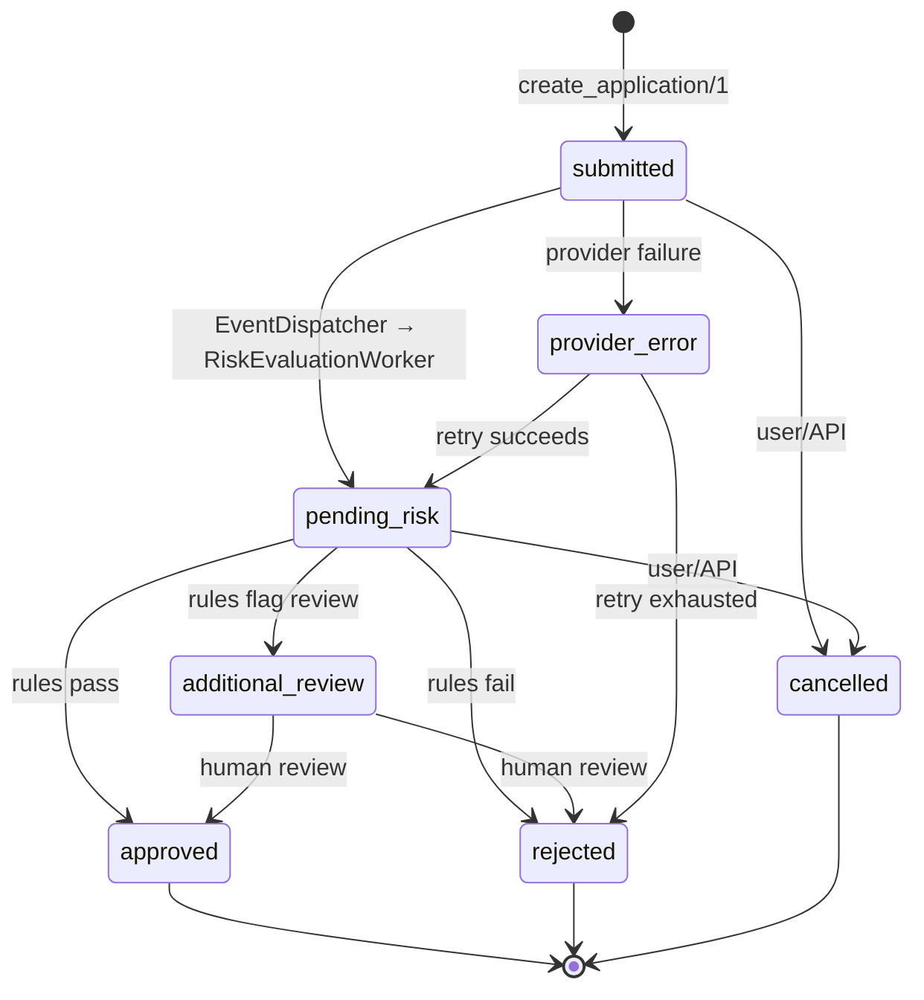

# Debt Stalker — Master Plan

>
> **Example countries (agreed):** Spain (`ES`) and Mexico (`MX`).
>
> **Method:** Spec-Driven Development (Specify → Plan → Tasks → Implement), reviewed through four planning lenses — **Tech Lead**, **Product Owner**, **Project Manager**, and **Delivery Lead**.

---

## 0. Document Map & Source Note

| Document | Role |
|----------|------|
| `docs/requirements.md` | **Canonical challenge brief** (the customer requirements). |
| `docs/master-plan.md` (this file) | Authoritative synthesis: review, architecture, roadmap, decisions, risks. |
| `docs/phases/phase-0.md` | Detailed scope for Phase 0 (Platform Foundation + tooling). |
| `docs/phases/phase-1.md` | Detailed scope for Phase 1 (ES + MX vertical slice). |
| `docs/phases/phase-2.md` | Detailed scope for Phase 2 (Resilience/Observability + Production hardening). |

## 1. Executive Summary & Objectives

**What we are building.** An MVP of a multi-country credit-application core for a fintech operating in 6 countries (ES, PT, IT, MX, CO, BR). The MVP must let users create credit applications, validate them against country-specific rules, enrich them with banking-provider data, process risk/audit/notifications asynchronously, expose query/list/status APIs, and reflect changes in a near-real-time frontend — all built so that **adding a country, provider, rule, status, or flow is additive, not disruptive**, and so the design is **ready to scale to millions of applications**.

**Why these objectives matter.** The challenge is graded on *architecture and flow quality*, not breadth. The winning move is a **thin but complete vertical slice** for two contrasting countries that proves every cross-cutting concern (async backbone, realtime, security, observability, scale-readiness) once, behind clean contracts.

**Why ES + MX.** They maximise contrast with minimum count:

- Different documents: **DNI** (ES) vs **CURP** (MX).
- Different rule shapes: ES exercises an **amount threshold** + **amount-to-income** ratio; MX exercises **amount-to-income** + a **provider-debt-to-income** ratio (uses provider data in the decision).
- Different regions: **Europe** vs **Latin America**, which surfaces locale/regulatory variation early.

**Definition of success (reframed as testable criteria):**

- A new evaluator can run the system locally in **< 5 minutes** with documented commands.
- An application created via API **or** the LiveView form flows end-to-end: synchronous validation → provider enrichment → persist → **Postgres trigger** writes an outbox event → worker processes it → status transition → **audit record** → **PubSub broadcast** → **UI updates without refresh**.
- Adding a third country touches **only** a new country module + provider adapter + registration — **no** controller, persistence, worker, or UI changes.
- All API endpoints (except health + token issuance) reject unauthenticated requests; PII never appears in logs or raw in responses.
- The README contains a credible scale analysis (indexes, partitioning, cursor pagination, archiving).

---

## 2. Requirements Review (Four Planning Lenses)

The four planning skills are interactive and gated. They were run here in **non-interactive mode**: each gate is documented inline and the review proceeds with noted assumptions.

### 2.1 Tech Lead — Technical Risk Report

> Treating `docs/requirements.md` as the PRD under review.

#### PRD Review Summary

| Axis | Verdict | Notes |
|------|---------|-------|
| Completeness | **Conditional Pass** | Functional + non-functional requirements are explicit and well-structured. Missing: measurable thresholds for "near real-time," concrete rule thresholds (left to implementer by design), and explicit auth/role model. |
| Testability | **Conditional Pass** | Most requirements are verifiable. Several use soft language ("reasonably valid," "near real-time," "without evident inconsistencies") that must be pinned to concrete acceptance criteria — done in §4 and the phase docs. |
| Clarity | **Conditional Pass** | Clear overall. Ambiguous terms ("scalable," "near real-time," "manual review") are resolved as explicit decisions in §6. |

**Open gaps (resolved in this plan):**

- Rule thresholds (ES amount threshold, income multiples) — *intentionally* left to the implementer; fixed in §5/§6.
- Meaning of "manual review" for the income rules — resolved to **flag `additional_review_required`** (not hard reject). See §6.
- "Near real-time" target — resolved to **sub-second p95 under local/demo load** via PubSub push (no polling).
- Auth model — resolved to **JWT with at least two roles** (read vs status-update). See §6.

#### Feasibility Assessment

| Concern | Area | Severity | Recommendation |
|---------|------|----------|----------------|
| DB-generated async via Postgres triggers → outbox is non-trivial to keep idempotent & ordered | Architecture | **Medium** | Use a dedicated `application_events` outbox + `FOR UPDATE SKIP LOCKED` dispatcher; idempotent workers keyed on event id. Cover with an integration test (insert/update → event row → worker). |
| DNI/CURP checksum correctness | NFR / Correctness | **Low** (mitigated) | Strict pre-validation implemented in `Countries.Curp` + `DniNie` (see ADR-0008); property + table tests; virtual birth_date cross-check. Remaining full weighted CURP digit can be added later. |
| "Millions of applications" with no real volume to test | Scalability | **Low** | Design for it (cursor pagination, composite indexes, partition-by-date plan) and *document* it; do not over-build in Phase 1. |
| PII handling vs "easy to run in <5 min" | Security vs Reproducibility | **Low** | Phase 1: encrypt `identity_document` at rest with Cloak from day one + hash for lookup + redact (last-4) in responses/logs. Local setup stays trivial — encryption key is a dev default in `config/dev.exs`. |
| Realtime UI tests can be flaky | Testing | **Low** | Test PubSub directly + LiveView lifecycle assertions. |
| Kubernetes manifests drifting from reality | Ops | **Low** | `kubectl apply --dry-run=client` validation in Makefile/CI. |

No **High**-severity concerns. All are solvable within scope.

#### Estimation Quality

- **Coverage:** High-level estimation posture provided per phase (see §2.3 and phase docs). Phase 1/2 task seeds are decomposed to ticket-sized units with acceptance criteria.
- **Realism flags:** Async backbone and LiveView realtime carry the most uncertainty → tagged **Medium** confidence; spikes recommended (trigger→outbox integration test; LiveView realtime harness).
- **Consistency:** Estimates are relative (story points) and applied consistently across the phase docs.

#### Go / No-Go Recommendation

**Recommendation: GO (with conditions).**

**Rationale:** The requirements are technically sound and buildable with a well-understood Elixir/Phoenix + PostgreSQL + Oban stack. The three prior model analyses independently converged on the same architecture, which is strong evidence of feasibility. The only real risks are correctness details (checksums), async idempotency, and not over-building for scale — all mitigated below.

**Conditions:**
1. Pin the ambiguous terms to the concrete decisions in §6 before implementation.
2. Stand up the trigger→outbox→worker integration test early (it de-risks the most novel requirement).
3. Keep Phase 1 strictly to ES + MX; resist adding countries before the vertical slice is green.

### 2.2 Product Owner — Scope & Traceability

**Scope summary (Phase 1 MVP):**

- Create applications (API + LiveView form) for ES and MX with country validation + simulated provider enrichment.
- Query one application; list with filters (country, status, date range) using cursor pagination.
- Update status through a single audited, validated transition path.
- Async processing via Postgres triggers → outbox → Oban workers (risk, audit, notification, webhook).
- One webhook (inbound) + one simulated external notification (outbound) flow.
- Near-real-time LiveView UI (list + detail + create) via PubSub.
- JWT auth (read vs update roles), structured logs, PII redaction, ETS country-config cache.
- Reproducible local run (Makefile + Docker Compose), k8s manifests, README with data model + scale analysis.

**Out of scope for Phase 1:** Real banking integrations; PT/IT/CO/BR; full KYC/AML; real k8s deployment & load tests; metrics dashboards; DLQ/circuit breakers/rate limiting. (These land in Phases 2–4.)

#### Requirements Traceability Matrix

Every requirement in `docs/requirements.md` is accounted for. "Phase" = where it is first satisfied.

| Req | Requirement (from `requirements.md`) | Treatment | Phase |
|-----|--------------------------------------|-----------|-------|
| 2.1 | Create credit applications | Implement (API + LiveView) | 1 |
| 2.2 | Validate country-specific rules | Implement (ES + MX) | 1 |
| 2.3 | Integrate banking provider by country | Implement (simulated adapters, normalized) | 1 |
| 2.4 | Query individual application | Implement (by UUID, redacted) | 1 |
| 2.5 | List applications filtered by country | Implement (+ status, date range, cursor) | 1 |
| 2.6 | Update application status | Implement (validated, audited transition) | 1 |
| 2.7 | Background + parallel processing | Implement (Oban + SKIP LOCKED) | 1 |
| 2.8 | Near-real-time frontend | Implement (LiveView + PubSub) | 1 |
| 3.1 | Application creation fields | Implement (all required fields) | 1 |
| 3.2 ES | Spain rules — DNI + amount threshold | Implement | 1 |
| 3.2 MX | Mexico rules — CURP + income ratio | Implement | 1 |
| 3.2 PT/IT/CO/BR | Other country rules | Defer (architecture supports) | 3–4 |
| 3.3 | Provider variation by country | Implement (behaviour + normalization) | 1 |
| 3.4 | Status flow per country, extensible | Implement (shared + country-narrowed) | 1 |
| 3.5 | Query an application | Implement | 1 |
| 3.6 | Listing + filters | Implement | 1 |
| 3.7 | Async processing + DB-native triggers | Implement (triggers → outbox) | 1 |
| 3.8 | Webhooks / external processes | Implement (inbound webhook + outbound notify) | 1 |
| 3.9 | Concurrency & parallel processing | Implement (Oban concurrency + idempotency) | 1 |
| 3.10 | Real-time updates on frontend | Implement (PubSub) | 1 |
| 4.1 | Architecture / separation of concerns | Implement (domain boundaries + behaviours) | 1 |
| 4.2 | API security (PII, JWT, authz) | Implement (JWT + roles + redaction) | 1 |
| 4.3 | Observability (structured logs, errors) | Implement (structured logs); metrics → 2 | 1 |
| 4.4 | Reproducibility (<5 min, README) | Implement (Makefile + Docker Compose) | 1 |
| 4.5 | Scalability / large volume analysis | Document + design (indexes, partitioning) | 1 (doc) / 4 (impl) |
| 4.6 | Queues & job queueing | Implement (Oban, documented) | 1 |
| 4.7 | Caching | Implement (ETS country config); app cache → 2 | 1 |
| 4.8 | Deployment (k8s manifests) | Implement (manifests, dry-run); real deploy → 2 | 1 (manifests) / 2 (deploy) |
| 5 | Required frontend (CRUD + realtime) | Implement (LiveView) | 1 |
| 6 | Deliverables (repo, README, k8s, Makefile) | Implement | 1 |
| Extras | More countries, metrics, advanced resilience | Defer | 2–4 |

**Gate — Scope Confirmation:** Documented (non-interactive). Scope reflects the agreed ES + MX MVP plus a clear deferral list.

### 2.3 Project Manager — Estimation Posture & Top Risks

**Estimation framework:** Story points (Fibonacci), 1 SP ≈ half a day, relative sizing.

| Phase | Rough size | Confidence | Notes |
|-------|-----------|------------|-------|
| Phase 0 — Foundation | S (5–8 SP) | High | Mostly scaffolding + config. |
| Phase 1 — ES+MX vertical | L (34–55 SP) | Medium | Async backbone + realtime carry uncertainty. |
| Phase 2 — Resilience + Production | M–L (21–34 SP) | Medium | Depends on real infra availability. |
| Phase 3 — PT+IT | M (13–21 SP) | High | Additive if Phase 1 contracts hold. |
| Phase 4 — CO+BR + scale | M–L (21–34 SP) | Medium | Partitioning + replicas need infra. |

**Top 3 risks (full register in §7):**
1. Async idempotency/ordering (trigger→outbox→worker) — **Owner: Tech Lead** — mitigate with SKIP LOCKED + event-id idempotency + integration test.
2. DNI/CURP correctness — **Owner: Backend dev** — documented rules + property tests.
3. Over-building for scale before the vertical slice is green — **Owner: Delivery Lead** — strict Phase 1 gate.

### 2.4 Delivery Lead — Phase Gating Model

Each phase has an **entry condition** and an **exit gate**. A phase cannot start until the prior gate is green.

```
Phase 0 ──[Foundation gate]──▶ Phase 1 ──[Vertical-slice DoD]──▶ Phase 2
   │                                                                │
   ▼                                                                ▼
make setup/test/credo/dialyzer/docs green            Resilience + prod-ready gate
+ rs-guard hook + CI pipeline                                     │
(no k8s yet — deferred to Phase 1)                                │
                                              ┌─────────────────────┴───────────┐
                                              ▼                                  ▼
                                     Phase 3 (PT+IT)                    Phase 4 (CO+BR + scale)
                                  [extensibility proven]            [millions-of-rows ready]
```

Hard gates: **Phase 0 DoD** (tooling + review infra green), **Phase 1 DoD** (every acceptance item true + invariants hold), and **Phase 2 production-readiness** (deploy + security). Phases 3 and 4 are additive and may run partly in parallel once Phase 1 contracts are frozen.

---

## 3. Cross-Model Synthesis — Best Approach per Requirement

The three prior analyses (**grok**, **kimi**, **openAI/v1**) were compared requirement-by-requirement. The remarkable result: **near-total consensus** on the architecture. The table marks the **consensus pick** and any deviation I make.

Legend: ✅ = all three agree · ⚠️ = minor divergence · ★ = my chosen approach.

| Requirement | grok | kimi | openAI/v1 | Consensus / ★ Decision |
|-------------|------|------|-----------|------------------------|
| Language/framework | Elixir/Phoenix | Elixir/Phoenix | Elixir/Phoenix | ✅ ★ Elixir/Phoenix, **single app** (not umbrella) |
| Countries in MVP | ES + MX | ES + MX | ES + MX | ✅ ★ ES + MX |
| Country logic isolation | Behaviour + Registry | Behaviour + Registry | Behaviour + Registry | ✅ ★ `Countries.Behaviour` + `Registry` (ETS-cached) |
| Provider integration | Behaviour + simulated adapters, normalized | Same | Same | ✅ ★ `Providers.Behaviour` + simulated deterministic adapters; raw payloads never persisted/exposed |
| Background jobs | Oban (Postgres) | Oban (Postgres) | Oban (Postgres) | ✅ ★ Oban |
| DB-generated async | Triggers → `application_events` outbox → SKIP LOCKED dispatcher | Same | Same | ✅ ★ Postgres triggers → outbox → `EventDispatcherWorker` (`FOR UPDATE SKIP LOCKED`) |
| Workers | Dispatcher, Risk, Audit, Notification, Webhook | Same | Same | ✅ ★ Same five workers |
| Realtime UI | LiveView + PubSub | LiveView + PubSub | LiveView + PubSub (default) | ✅ ★ LiveView + PubSub |
| Auth | JWT (Joken) | JWT (Joken) | JWT | ✅ ★ JWT (Joken), env secret, read vs update roles |
| Status flow | submitted→pending_risk→{additional_review, approved, rejected} + provider_error, cancelled | Same | Same | ✅ ★ Shared statuses; country modules may *narrow* |
| Transition path | Single validated + audited + broadcast | Same | Same | ✅ ★ One `update_status/3` → validate → transition row → audit → PubSub |
| ES amount threshold | >15000 → additional_review | Same | Same | ✅ ★ `> 15000.00 EUR` → `additional_review_required` |
| ES income rule | >12× income → flag review | >12× income → flag review | >12× income → "reject unless manual review" | ⚠️ ★ **Flag `additional_review_required`** (keep app in system) — see §6 |
| MX income rule | >10× income → review | Same | Same | ✅ ★ `> 10× income` → review |
| MX debt rule | debt+amount > 18× income → review | Same | Same | ✅ ★ `provider_debt + amount > 18× income` → review |
| Pagination | Cursor/keyset | Cursor/keyset | Cursor/keyset | ✅ ★ Cursor pagination (no unbounded OFFSET) |
| PII | encrypt + hash + redact | Same | Same | ✅ ★ Phase 1: encrypt `identity_document` at rest (Cloak) + `identity_document_hash` for lookup + last-4 redaction in responses/logs |
| Caching | ETS country config | ETS; app cache deferred | ETS country config | ✅ ★ ETS country config in Phase 1; **app-level detail cache → Phase 2** |
| Data model | 6 core tables | 6 core tables | 6 core tables | ✅ ★ `credit_applications`, `application_status_transitions`, `application_events`, `audit_logs`, `webhook_events`, `notification_attempts` |
| Indexes | (country,status,date)+ | Same | Same | ✅ ★ Composite + FK + outbox + hash indexes |
| Scale | Partition by date, archive | Same | Same | ✅ ★ Range partition by `application_date`; document, implement in Phase 4 |
| k8s | Manifests, dry-run | Manifests + migration job | Manifests | ✅ ★ Manifests + migration job; real deploy → Phase 2 |
| Reproducibility | Makefile + Docker | Makefile + Docker + seeds | Makefile/Justfile + Docker | ✅ ★ Makefile + Docker Compose + seeds, <5 min |
| Phasing | Phase 0 + Phase 1 vertical + later | 3 phases | v1 only | ⚠️ ★ **5-phase roadmap** (§5) reconciling both |

**Where I deviate from any single model:**
- **ES income rule → flag, not reject.** Two of three models already do this; it matches the spec's "unless manually reviewed" wording better and keeps applications inside the system for a human decision. Documented as an explicit decision (§6).
- **Explicit Phase 0 + 5-phase roadmap.** grok hints at a substrate phase; kimi folds it into Phase 1; v1 has no roadmap. I make Phase 0 explicit and reconcile expansion vs scale into separate phases for cleaner gating.
- **Encryption-at-rest and app-level cache are firmly placed in Phase 2**, removing the "maybe" ambiguity the models left open.

---

## 4. My Architectural Recommendation

The synthesis converges on a clean layered architecture. The non-negotiable spine is: **country/provider knowledge lives behind behaviours; the persistence layer is country-agnostic; database writes generate async work via triggers; every status change is audited and broadcast.**

### 4.1 Invariants (must always hold)

1. No web/controller/LiveView code contains country rules, document validation, financial rules, or transition logic.
2. Country logic lives only in `DebtStalker.Countries.*` behind a behaviour + registry.
3. Provider logic lives only in `DebtStalker.Providers.*`; **raw provider payloads are never persisted or exposed**; only normalized `provider_summary`.
4. Every status change goes through **one** function that validates the transition, records an `application_status_transitions` row, writes an `audit_logs` entry, and emits a PubSub event.
5. All list queries are **cursor-paginated**.
6. `application_date` is always **server-set**.
7. Full `identity_document` is **never** logged; responses redact to last-4.
8. Async work driven by data changes originates from **Postgres triggers → `application_events`**.

### 4.2 Domain Boundaries

| Module | Owns | Must NOT |
|--------|------|----------|
| `DebtStalker.Countries` | Document/financial validation, rule interpretation, allowed transitions; `ES` + `MX`; `Registry` | DB, web |
| `DebtStalker.Providers` | Fetch + normalize provider data; simulated `ES`/`MX` adapters | Decisions, persistence of raw payloads |
| `DebtStalker.Applications` | Lifecycle: `create/1`, `get/1`, `list/1`, `update_status/3`; orchestration | Country rules |
| `DebtStalker.Risk` | Async risk evaluation logic | Web, transport |
| `DebtStalker.Audit` | Append-only audit records | Business decisions |
| `DebtStalker.Notifications` | Outbound notifications + inbound webhook processing | Country rules |
| `DebtStalker.Workers` | Oban workers (Dispatcher, Risk, Audit, Notification, Webhook) | Business rules (delegate to contexts) |
| `DebtStalkerWeb` | Transport, JWT auth, JSON serialization (redacted), LiveView, webhook controller | Domain logic |

### 4.3 System Architecture (high level)

```mermaid
flowchart TD
    subgraph Client
        UI[LiveView UI<br/>List / Create / Detail]
        APIClient[API Client]
    end

    subgraph Web[DebtStalkerWeb]
        Auth[JWT Auth + Authz Plugs]
        API[JSON API - redacted]
        LV[LiveViews]
        WH[Webhook Controller - signature verify]
    end

    subgraph Domain[DebtStalker Domain]
        Apps[Applications Context<br/>create / get / list / update_status]
        Countries[Countries<br/>Behaviour + Registry<br/>ES / MX]
        Providers[Providers<br/>Behaviour + Simulated Adapters]
        Risk[Risk]
        Audit[Audit]
        Notifs[Notifications]
    end

    subgraph Async[Oban Workers]
        Disp[EventDispatcherWorker<br/>FOR UPDATE SKIP LOCKED]
        RiskW[RiskEvaluationWorker]
        AuditW[AuditWorker<br/>(deferred — see ADR-0004)]
        NotifW[ExternalNotificationWorker]
        WebhookW[ProviderWebhookWorker]
    end

    subgraph DB[PostgreSQL]
        CA[(credit_applications)]
        EV[(application_events - OUTBOX)]
        TR[(application_status_transitions)]
        AU[(audit_logs)]
        WE[(webhook_events)]
        NA[(notification_attempts)]
    end

    subgraph Infra
        PubSub[(Phoenix PubSub)]
        ETS[ETS Country Cache]
    end

    APIClient --> Auth
    UI --> Auth
    Auth --> Apps
    Auth --> WH
    Apps --> Countries
    Apps --> Providers
    Apps --> CA
    CA -- INSERT / UPDATE status --> Trig[PostgreSQL Triggers]
    Trig --> EV
    EV --> Disp
    Disp --> RiskW & AuditW & NotifW & WebhookW
    RiskW --> Apps
    WebhookW --> Apps
    Apps --> TR
    Apps --> AU
    Apps --> PubSub
    PubSub --> UI
    Apps -. cache .-> ETS
```

### 4.4 Async Backbone (the critical requirement)

```
write (create / update status)
  → PostgreSQL TRIGGER (AFTER INSERT / AFTER UPDATE OF status)
    → INSERT row into application_events (outbox)
      → EventDispatcherWorker claims unprocessed rows with FOR UPDATE SKIP LOCKED
        → enqueues specialized Oban jobs (Risk / Notification / Webhook)
          → audit is synchronous in Ecto.Multi (see ADR-0004)
          → workers call back through Applications context (validated transition)
            → audit row + PubSub broadcast → LiveView updates
```

Concurrency safety = `SKIP LOCKED` claim + **idempotent** workers (keyed on event id / current status / notification-attempt uniqueness). Scaling = increase Oban queue concurrency or run more worker instances; no code changes.

### 4.5 Data Model (Phase 1)

Core tables: `credit_applications`, `application_status_transitions`, `application_events`, `audit_logs`, `webhook_events`, `notification_attempts`. `credit_applications` holds `id (uuid)`, `country`, `full_name`, `identity_document`, `identity_document_hash`, `requested_amount`, `monthly_income`, `application_date`, `status`, `additional_review_required`, `provider_summary (jsonb, normalized only)`, `risk_result (jsonb)`, timestamps. (Full field list in `docs/phases/phase-1.md`.)

**Indexes (Phase 1):** `(country, status, application_date)`, `(application_date)`, `application_events(processed_at, inserted_at)`, FK indexes, `identity_document_hash`.

### 4.6 API Surface

| Method | Path | Auth | Purpose |
|--------|------|------|---------|
| POST | `/api/auth/token` | public | Issue demo JWT |
| GET | `/api/health` | public | Health check |
| POST | `/api/applications` | update | Create application |
| GET | `/api/applications/:id` | read | Get one (redacted) |
| GET | `/api/applications` | read | List + filters (cursor) |
| PATCH | `/api/applications/:id/status` | update | Update status |
| POST | `/api/webhooks/provider-confirmations` | webhook secret | Inbound provider event |

### 4.7 Security, Caching, Scale (summary)

- **Security:** JWT (env secret, fail-fast in prod), read vs update roles, PII encrypted at rest (Cloak) + hash for lookup + redaction in responses + logs, normalized-only provider data.
- **Caching:** ETS for static country config (invalidation = boot/redeploy) in Phase 1; app-level detail cache with PubSub invalidation in Phase 2.
- **Scale (documented now, implemented in Phase 4):** cursor pagination, composite indexes, range partition by `application_date`, archive old audit/notification rows, read replicas for list/detail.

### 4.8 Code Organization Contract (non-negotiable)

This contract applies to ALL generated Elixir code regardless of phase. It is enforced by Credo, Dialyzer, and rs-guard reviews.

**1. Contexts** — Domain logic lives in `DebtStalker.<Context>` modules (`Applications`, `Countries`, `Providers`, `Risk`, `Audit`, `Notifications`). Each context exposes a public API (functions with `@doc` + `@spec`) and may have internal implementation modules. Web layer (`DebtStalkerWeb`) calls contexts only — never reaches into internal modules.

**2. Structs** — Domain entities use typed structs as the primary data shape, not raw maps:
- `%CreditApplication{}` — the core application entity
- `%ProviderSummary{}` — normalized provider data (never raw payloads)
- `%CountryConfig{}` — country validation metadata (cached in ETS)
- `%StatusTransition{}` — a validated transition request
- `%EventEnvelope{}` — outbox event shape
- Ecto schemas embed or wrap these structs where persistence is needed. The boundary between Ecto schema and domain struct is explicit: the context maps between them.

**3. Composition** — Behaviours define contracts via `@callback`; modules implement them with `@behaviour`. The Registry pattern dispatches to country/provider modules — no `if/cond/case` branching on country or provider code outside `Countries` and `Providers` contexts. Credo custom check enforces this (Phase 0).

**4. ExDoc** — Every public module has `@moduledoc`. Every public function (`@doc true` or implicit) has `@doc` and `@spec`. All `@type`/`@opaque` declarations have `@typedoc`. `mix docs` must generate without warnings. ExDoc output is the canonical API reference.

**5. Typespecs** — `@spec` on every public function. `@type` for shared types (defined in the context module or a dedicated `Types` module). Dialyzer runs in CI with `--halt-exit-status`. Success typing is the analysis mode. `.dialyzer_ignore.exs` is permitted only for known false positives with a documented reason.

**6. Credo** — `.credo.exs` configured with strict checks. `mix credo --strict` must pass. Custom checks (Phase 0):
- No country/provider branching (`if country == "ES"`) outside `DebtStalker.Countries` / `DebtStalker.Providers`.
- No `IO.inspect` in committed code.
- All public functions have `@spec`.

**7. frozen_string_literal** — Not applicable to Elixir (strings are already immutable), but the equivalent discipline applies: no mutation of shared state outside GenServer/Agent boundaries.

### 4.9 Error Handling Strategy

Consistent error shapes across all layers:

| Layer | Success | Error |
|-------|---------|-------|
| Domain contexts | `{:ok, struct}` | `{:error, %Ecto.Changeset{}}` for validation; `{:error, atom}` for domain errors (`:not_found`, `:invalid_transition`, `:provider_unavailable`) |
| Oban workers | `:ok` | `{:cancel, reason}` for permanent failures; `{:error, reason}` for transient (Oban retries) |
| API controllers | `200` with serialized data | `422` with `{"errors": {"field": ["message"]}}`; `401`/`403` with `{"error": "message"}`; `404` with `{"error": "not found"}` |
| Webhook controller | `200` with `{"received": true}` | `401` bad signature; `404` unknown application; `422` invalid payload |
| LiveView | `{:ok, socket}` | `{:error, changeset}` → render inline errors; `{:error, :not_found}` → redirect with flash |

**Domain error atoms** (shared, documented): `:not_found`, `:invalid_transition`, `:provider_timeout`, `:provider_unavailable`, `:invalid_document`, `:unsupported_country`, `:already_processed`.

### 4.10 Structured Logging Specification

| Aspect | Decision |
|--------|----------|
| Backend | `logger_json` (JSON structured logs) in all environments |
| Format | JSON with timestamp, level, message, and metadata fields |
| Required metadata fields | `application_id` (when available), `event_id` (when available), `country`, `status`, `worker` (when in a job) |
| Log levels | `dev`: `debug`, `test`: `warning`, `prod`: `info` |
| PII redaction | Central redaction filter: `identity_document` → `last-4`, `full_name` → `first_name + last initial`, `provider_summary` → allowed fields only. No raw provider payloads. |
| Log events (minimum) | Application creation, validation failures, provider calls (success/failure), job enqueue, job completion/failure, webhook receipt, status transitions |

### 4.11 Testing Strategy

| Concern | Tool | Pattern |
|---------|------|---------|
| Provider mocking | Mox | Define `DebtStalker.Providers.Behaviour` mock; `Mox.expect/3` for deterministic responses; `Mox.verify_on_exit!` in tests |
| Worker testing | Oban.Testing | `assert_enqueued/1`, `perform_job/2` for synchronous worker execution; no real Oban queue in tests |
| PubSub | Phoenix.PubSub directly | `Phoenix.PubSub.subscribe/2` in test process; `assert_received` on broadcast; no LiveView mount needed for PubSub tests |
| LiveView | `live_isolated` / `live/2` | Full lifecycle assertions: mount → render → event → update |
| Time | Custom helper via `NaiveDateTime.utc_now()` injection | No `Time.now` stubbing; context functions accept an optional `now` argument defaulting to `DateTime.utc_now/0`; tests pass explicit times |
| Document validation | StreamData (property-based) | Property tests for DNI/CURP format + checksum; table tests for edge cases |
| Database | Ecto sandbox | `Ecto.Adapters.SQL.Sandbox` in async mode; `DataCase` for domain tests, `ConnCase` for API tests |
| Integration | Trigger→outbox→worker | Dedicated integration test: INSERT → assert `application_events` row → `perform_job` → assert status changed |

### 4.12 Status Flow (State Machine)



**Per-country narrowing (Phase 1):**

| Country | Narrowing |
|---------|-----------|
| ES | No narrowing — full transition set allowed |
| MX | No narrowing — full transition set allowed |

Country modules return their allowed transitions from `allowed_status_transitions/0`. The `update_status/3` function validates against the country module's set. Future countries may restrict further (e.g., a country that doesn't allow `cancelled` from `pending_risk`).

---

## 5. Global Roadmap — 5 Phases (Phase 0–4)

> Balanced roadmap (your selection). Phase 0 is the platform substrate; Phase 1 is the complete vertical slice; Phase 2 hardens for production; Phases 3–4 expand countries and scale.

### Phase 0 — Platform Foundation → `docs/phases/phase-0.md`
**Goal:** A runnable, empty-but-wired skeleton with full tooling, code review infrastructure, and development guidelines.
**Delivers:** Phoenix app (Postgres + LiveView + Ecto); deps (`oban`, `joken`, `credo`, `dialyxir`, `ex_doc`, `mox`, `stream_data`, `logger_json`); `dev/test/runtime` config; Docker Compose for Postgres; `Makefile` (`setup`, `db`, `migrate`, `seed`, `run`, `test`, `format`, `lint`, `dialyzer`, `docs`); CI (format + warnings-as-errors + credo strict + dialyzer + tests); **rs-guard** pre-commit hook + `.github/review-prompt.md` + `.reviewer.toml`; **CodeRabbit** CI configuration; `.credo.exs` with strict checks; `.dialyzer_ignore.exs` baseline; `AGENTS.md` (coding guidelines, TDD policy, code org contract, review loop); `CHANGELOG.md` initialized; `docs/adr/` directory; `docs/postman/debt-stalker.json` skeleton; `.tool-versions` pinned. **k8s manifests are deferred to Phase 1** (they reference actual components that don't exist yet).
**Exit gate:** `make setup && make test && mix credo --strict && mix dialyzer && mix docs` all green; rs-guard pre-commit hook functional; CI pipeline runs end-to-end. See `docs/phases/phase-0.md` for full DoD.

### Phase 1 — ES + MX Vertical Slice  → `docs/phases/phase-1.md`
**Goal:** Every functional + non-functional requirement satisfied end-to-end for ES + MX.
**Delivers:** schema + triggers + outbox; `Countries` behaviour + ES + MX + registry; `Providers` behaviour + 2 simulated adapters; `Applications` lifecycle; async pipeline (5 workers); JWT API + signed webhook; LiveView realtime UI; audit + redaction + structured logs; reproducibility + k8s manifests + README with scale analysis.
**Exit gate:** Phase 1 Definition of Done (see phase doc) fully true; invariants hold.

### Phase 2 — Resilience, Observability & Production Hardening → `docs/phases/phase-2.md`
**Goal:** Make the vertical slice production-credible. (Sub-tracks 2a + 2b.)
**2a Resilience/Observability:** `:telemetry` + metrics (Prometheus/StatsD), LiveDashboard, provider circuit breakers + retry budgets, dead-letter handling for exhausted jobs, rate limiting (webhooks + auth), app-level detail caching with PubSub invalidation.
**2b Production/Security:** real k8s deploy (ingress, HPA, health/readiness probes), CI/CD pipeline, secrets management, log scrubbing review. (PII encryption is already in place from Phase 1.)
**Exit gate:** deployable to a real cluster; metrics visible; secrets + log scrubbing in place.

### Phase 3 — Country Expansion (PT + IT)
**Goal:** Prove the abstraction is truly additive.
**Delivers:** `Countries.PT` (NIF + income/amount rule) and `Countries.IT` (Codice Fiscale + financial-stability rule) + their simulated provider adapters + registration. **Acceptance:** no changes to controllers, persistence, workers, or UI — only new modules + registry entries + tests.
**Exit gate:** PT + IT pass the same end-to-end flow ES + MX do.

### Phase 4 — Scale & Remaining Countries (CO + BR)
**Goal:** Be ready for millions of rows and complete country coverage.
**Delivers:** `Countries.CO` (CC + debt-to-income) and `Countries.BR` (CPF + credit-score/payment-capacity); range partitioning of `credit_applications` by `application_date`; read replicas for list/detail; archive jobs for old audit/notification rows; load-test harness; revisit composite partitioning if query distribution is country-heavy.
**Exit gate:** documented load test + partitioning migration verified on representative data.

---

## 6. Key Decisions Log

| # | Decision | Choice | Rationale | Reversible? |
|---|----------|--------|-----------|-------------|
| D1 | MVP countries | ES + MX | Distinct documents + rule shapes; Europe + LatAm | Yes (additive) |
| D2 | Framework | Elixir/Phoenix, single app | 3-model consensus; concurrency + PubSub native | Partially |
| D3 | Jobs | Oban on Postgres | Durable, retryable, simple local setup | Partially |
| D4 | DB-generated async | Trigger → `application_events` outbox → SKIP LOCKED dispatcher | Explicitly satisfies the requirement; decouples triggers from Oban | Yes |
| D5 | Frontend | LiveView + PubSub | Near-realtime with fewest moving parts | Yes (API/PubSub can serve an SPA later) |
| D6 | Auth | JWT (Joken), read vs update roles | Requirement; simple demo token endpoint | Yes |
| D7 | **ES amount > 12× income** | **Flag `additional_review_required` (not hard reject)** | Matches "unless manually reviewed"; keeps app in system; 2/3 models agree | Yes |
| D8 | PII (Phase 1) | Encrypt at rest (Cloak) + hash + last-4 redaction | Fintech compliance: no raw PII unencrypted even in MVP. Dev key in `config/dev.exs` keeps <5-min setup. | Yes |
| D9 | Pagination | Cursor/keyset from day one | Scale-ready; avoids OFFSET bottleneck | Yes |
| D10 | Caching (Phase 1) | ETS country config; app cache → Phase 2 | Static config is safe to cache; detail cache adds invalidation complexity | Yes |
| D11 | Providers | Simulated deterministic adapters | Repeatable tests + fast setup | Yes (real adapters implement same behaviour) |
| D12 | Roadmap | 5 phases (0–4); Phase 2 = resilience + production | Clean gating; separates expansion from scale | Yes |
| D13 | TDD enforcement | Hard gate per feature/user-story | Tests-first for domain/worker/API/web tasks; exempt: chores, migrations, ops, docs | Yes |
| D14 | Code review loop | rs-guard (DeepSeek Pro) local pre-commit + CI; CodeRabbit in CI; max 3 iterations per task | Automated quality gate on every commit; human reviews final PR | Yes |
| D15 | Code organization | Contexts + Structs + Composition + ExDoc + Typespecs (§4.8) | Enforced by Credo strict + Dialyzer + rs-guard; canonical API reference via ExDoc | Partially |
| D16 | API test artifacts | Single growing Postman collection (`docs/postman/debt-stalker.json`) | One file that evolves per phase; each API task adds endpoints with examples | Yes |
| D17 | Phase documentation | CHANGELOG.md (Keep-a-Changelog) + ADRs (`docs/adr/NNNN-*.md`) + Phase Report (`docs/phases/phase-N-report.md`) per phase | Enables context window/agent handoff; audit trail of decisions; structured change log | Yes |
| D18 | rs-guard LLM provider | DeepSeek Pro (`deepseek-v4-pro`) | Deeper analysis than flash; good cost/quality balance for iterative review loops | Yes |

---

## 7. Consolidated Risk Register

| Risk | Likelihood | Impact | Proximity | Mitigation | Owner |
|------|------------|--------|-----------|------------|-------|
| Async idempotency/ordering (trigger→outbox→worker) | Med | High | Near | `FOR UPDATE SKIP LOCKED`; idempotent workers keyed on event id; integration test early | Tech Lead |
| DNI/CURP checksum correctness | Low | Med | Mitigated in curp-dni work | Strict rules + structured errors + ADR-0008; see Phase 2 refinement ticket #123 | Backend dev |
| Over-building for scale before slice is green | Med | High | Near | Strict Phase 1 gate; design-not-implement for scale | Delivery Lead |
| LiveView realtime tests flaky | Med | Med | Mid | Test PubSub directly; LiveView lifecycle assertions | Frontend dev |
| Provider failure orphans applications | Low | Med | Near | Always persist with recoverable `provider_error` status | Backend dev |
| k8s manifests drift | Low | Low | Far | `kubectl --dry-run=client` in Makefile/CI | DevOps |
| <5-min setup regresses | Low | Med | Mid | Docker Compose + seeds; CI time check | DevOps |
| PII leakage in logs/responses | Low | High | Near | Central redaction helper; PII encrypted at rest from Phase 1; log review in Phase 2 | Tech Lead |

---

## 8. Next Steps

1. **Review** this master plan + `docs/phases/phase-0.md` + `docs/phases/phase-1.md` + `docs/phases/phase-2.md`.
2. On approval, **Phase 0** (foundation) can begin — it is low-risk scaffolding + tooling setup.
3. The **task seeds** in the phase docs are written ticket-ready (area-prefixed, with acceptance criteria) so they can be imported via the **`github-issue`** skill into a project board with milestones per phase.
4. Implementation follows **Spec-Driven Development** (see §8.1 below): failing test → implement → green → rs-guard review → iterate, with the trigger→outbox→worker integration test prioritized as the earliest de-risking spike.

### 8.1 Spec-Driven Development Workflow (per task)

Every domain/worker/API/web task follows this loop:

```
1. Write failing test for the user-story acceptance criteria
2. Run test → verify it FAILS for the right reason (feature missing, not syntax error)
3. Implement minimal code to pass
4. Run test → verify PASSES
5. Run full suite: mix format --check-formatted && mix credo --strict && mix dialyzer && mix test
6. rs-guard local review (pre-commit or manual `rs-guard`)
   → Evaluate findings:
     [Critical]/[Security] → must fix
     [Important] → fix if ≤2, document if deferred
     [Suggestion] → optional
7. Iterate (max 3 rounds total: implement → review → fix → review → fix → review)
8. Commit only when rs-guard returns APPROVE or COMMENT
9. PR triggers rs-guard + CodeRabbit in CI (second opinion)
10. Human reviews final PR (validates end result + Postman/test flow) — **one PR per issue**, tagged with `phase-N` label
```

**TDD-exempt tasks** (no test-first gate, but tests still required where applicable): `[CHORE]`, `[INFRA]`, `[DB]` migrations, `[OPS]`, `[DOCS]`.

### 8.2 Phase Documentation Protocol

Each phase produces three documentation artifacts:

**1. CHANGELOG.md entry** (Keep-a-Changelog format):
```markdown
## [Phase N] — YYYY-MM-DD
### Added
- ...
### Changed
- ...
### Deprecated
- ...
### Removed
- ...
### Fixed
- ...
### Security
- ...
```

**2. Architecture Decision Records** (`docs/adr/NNNN-title.md`):
Each significant decision made during implementation (not just pre-planned ones) gets an ADR:

- ADR-0008: Strict document validation hardening for CURP/DNI (DRY/YAGNI + future country extensibility). See GitHub #122 and phase-2-refinement ticket #123.
```markdown
# NNNN. Title
## Status
Accepted | Superseded by ADR-NNNN | Deprecated
## Context
Why this decision was needed.
## Decision
What was decided.
## Consequences
Positive + negative impacts.
```

**3. Phase Completion Report** (`docs/phases/phase-N-report.md`):
```markdown
# Phase N Completion Report
## What Was Built
- (linked to GitHub issues/tickets)
## Decisions Made
- (linked to ADRs)
## Risks Materialized
- (vs. risk register — which risks actually occurred and how they were handled)
## Test Status
- Coverage: X%
- Suite: green / known gaps
## Deferred Items
- (moved to later phases with rationale)
## Next-Agent Instructions
- What a fresh context window/agent needs to know to continue
- Key files, patterns, gotchas
## Postman Collection
- Updated endpoints in docs/postman/debt-stalker.json
```

This protocol ensures that any new context window or agent can pick up where the previous one left off without re-reading the entire codebase.

### 8.3 Session Handoff Prompts (`docs/handoff/`)

Each phase has a **session starter prompt** in `docs/handoff/`:

| File | Purpose |
|------|---------|
| `docs/handoff/README.md` | How to use + how to create future handoffs |
| `docs/handoff/phase-0-start.md` | Phase 0 session starter |
| `docs/handoff/phase-1-start.md` | Phase 1 session starter |
| `docs/handoff/phase-2-start.md` | Phase 2 session starter |

**Usage:** Start a fresh Devin session, paste the contents of the relevant handoff file as the first message. The agent reads the docs, invokes the right skills, and starts picking off issues from the milestone.

Each handoff file includes:
- What docs to read first (in order)
- Which Elixir/Phoenix skills to invoke and when
- The per-task workflow (TDD cycle + rs-guard loop + commit)
- Key decisions already made (from prior phases)
- The critical path + parallelizable tasks
- Which GitHub milestone/issues to work from

## 9. Optional Real Providers (Future Reference)

Current implementation (Phase 1 delivered, Phase 2 in progress) uses:
- Local format + checksum validation for DNI (ES) and CURP (MX) — see `DebtStalker.Countries`.
- Simulated deterministic provider adapters (`DebtStalker.Providers.ESAdapter` / `MXAdapter`) that return normalized `ProviderSummary` only.

These choices are intentional (see Decision D11) to satisfy reproducibility, fast local setup, repeatable tests, and zero external secrets.

For future consideration (after current phases), researched options for **real** services are documented in:

**→ `docs/optional-real-providers.md`**

That document covers:
- CURP lookup / validation services (official gob.mx + commercial with free tiers such as Didit, Tlaloc, Veriff, etc.)
- DNI validation reality (local checksum is complete and authoritative; stronger name-binding is paid KYC)
- Free developer sandboxes for banking/credit data: BBVA API Market (ES + MX), Santander developer portals, Belvo (MX/CO/BR)
- SantanderAI GitHub org (AI/ML tools — relevant for future risk/fraud/fairness work, not for ID or raw provider fetch)
- Integration considerations and decision criteria ("when would it be worthy?")

**Important:** Any real adapter work would be additive only (new optional adapters behind the existing `Providers.Behaviour`), with simulation remaining the default for tests/CI/seeds. This is tracked as potential post-Phase 2 / "optional providers" future work. No changes to active phases.
