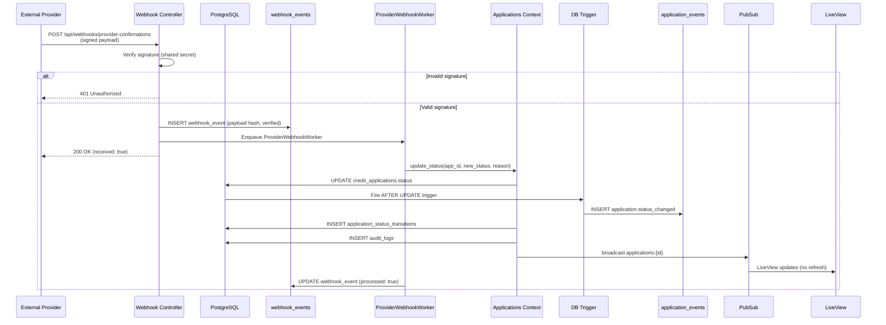

# Phase 1 — ES + MX Vertical Slice

> **Parent:** `docs/master-plan.md` · **Source of truth for requirements:** `docs/requirements.md`
> **Status:** Planning artifact only. No code written.
> **Goal:** One complete, correct, observable end-to-end flow for **Spain (ES)** and **Mexico (MX)** that exercises every functional and non-functional requirement and proves the global architecture. After Phase 1, anyone should be able to explain the whole system from this slice.

---

## 1. Phase Goal & Boundaries

**Entry condition:** Phase 0 foundation gate green — `make setup && make test && mix credo --strict && mix dialyzer && mix docs` all pass; rs-guard pre-commit hook functional; CI pipeline operational. See `docs/phases/phase-0.md` for full Phase 0 DoD.

**In scope:** create / validate / enrich / query / list / status-update applications for ES + MX; async backbone (triggers → outbox → workers); one inbound webhook + one outbound simulated notification; near-real-time LiveView UI; JWT auth + roles; structured logs + PII redaction; ETS country cache; reproducible local run; **k8s manifests** (moved from Phase 0 — they reference actual components built in this phase); README with data-model + scale analysis; Postman collection populated; CHANGELOG + ADRs + Phase Report.

**Out of scope (deferred):** real providers; PT/IT/CO/BR; PII encryption at rest; metrics/dashboards; circuit breakers; DLQ; rate limiting; app-level detail cache; real k8s deploy; load testing. (See Phase 2–4.)

---

## 2. Product Perspective

### 2.1 Personas
- **Applicant data entry / API consumer** — creates applications (read + create role).
- **Operations reviewer** — lists, inspects, and updates application status (update role).
- **External provider system** — sends webhook confirmations.
- **Evaluator** — runs the system locally and verifies the flow.

### 2.2 User Stories & Acceptance Criteria

**US-1 — Create an application (API + UI)**
> As an API consumer / operator, I can create a credit application for ES or MX so it enters risk processing.
- **AC1.1** Required fields accepted: country, full name, identity document, requested amount, monthly income; `application_date` and initial `status` are server-set.
- **AC1.2** Invalid country, non-positive amounts/income, or bad document format return `422` with field-level messages.
- **AC1.3** On success, status = `submitted`, `provider_summary` is populated (normalized), and the response redacts the document to last-4.
- **AC1.4** Creation generates durable async work (an `application_events` row appears).

**US-2 — Country rules enforced**
> As the business, country-specific rules are applied at creation.
- **AC2.1 (ES)** Document must match DNI format + checksum (simplification documented if used).
- **AC2.2 (ES)** `requested_amount > 15000.00` → `additional_review_required = true`.
- **AC2.3 (ES)** `requested_amount > 12 × monthly_income` → `additional_review_required = true` (flagged, **not** rejected — decision D7).
- **AC2.4 (MX)** Document must match CURP format (uppercase alphanumeric, expected length).
- **AC2.5 (MX)** `requested_amount > 10 × monthly_income` → `additional_review_required = true`.
- **AC2.6 (MX)** `provider_debt + requested_amount > 18 × monthly_income` → `additional_review_required = true`.

**US-3 — Provider enrichment**
> As the system, I fetch and normalize banking data per country.
- **AC3.1** Each country has a simulated adapter implementing a shared behaviour; responses are deterministic.
- **AC3.2** Only normalized fields are stored in `provider_summary`; raw payloads never persisted or returned.
- **AC3.3** Provider failure moves the application into a recoverable `provider_error` state (no silent success).

**US-4 — Query an application**
- **AC4.1** Authenticated `GET /api/applications/:id` and a LiveView detail page return full safe (redacted) data.
- **AC4.2** Unknown id returns `404`.

**US-5 — List & filter applications**
- **AC5.1** `GET /api/applications` and the LiveView list support filters: country, status, `application_date` range.
- **AC5.2** Results use **cursor pagination** (no unbounded OFFSET).
- **AC5.3** The UI allows filtering by country and status.

**US-6 — Update status (audited + realtime)**
- **AC6.1** Status changes go through one validated transition function; invalid transitions are rejected.
- **AC6.2** Every transition writes an `application_status_transitions` row and an `audit_logs` entry.
- **AC6.3** Transitions emit a PubSub event; the UI updates **without manual refresh**.
- **AC6.4** Update requires the update role (`403` otherwise).

**US-7 — Async processing visible**
- **AC7.1** Creating an application triggers (via Postgres trigger) `application.created`; a status update triggers `application.status_changed`.
- **AC7.2** `EventDispatcherWorker` claims events with `FOR UPDATE SKIP LOCKED` and enqueues specialized workers.
- **AC7.3** Risk evaluation moves the application through `pending_risk` → `approved`/`rejected`/`additional_review`.
- **AC7.4** Job failures are logged with `application_id` and are retryable; reruns do not duplicate side effects.

**US-8 — Webhook + notification**
- **AC8.1** `POST /api/webhooks/provider-confirmations` verifies a shared-secret/signature; invalid → `401/403`.
- **AC8.2** A valid webhook writes a `webhook_events` row and updates state only through a validated transition.
- **AC8.3** When an application reaches `approved` or `rejected`, a notification job runs; with no configured endpoint it stores a simulated successful result locally.

**US-9 — Realtime UI**
- **AC9.1** List and/or detail update live on status changes via PubSub.
- **AC9.2** UI clearly shows validation errors and async states (e.g., "pending risk evaluation").

### 2.3 Demo Script (what "done" looks like)
1. `make run` → app + Postgres up in < 5 min.
2. Get a JWT from `/api/auth/token`.
3. Create an ES application over the threshold → it is flagged `additional_review_required`; create a valid MX application.
4. Watch the LiveView list update live as workers move applications to `pending_risk` then to a final status.
5. POST a webhook confirmation → see a status transition + audit entry appear live.
6. Show structured logs (no full document/PII) and the `application_events` outbox rows.
7. Open Postman collection → run the full API flow (auth → create → list → get → status update → webhook).

---

## 3. Technical Scope

### 3.1 Modules
- `DebtStalker.Countries` — `Behaviour` (`validate_document/1`, `validate_financials/1`, `interpret_provider_summary/1`, `additional_review_required?/1`, `allowed_status_transitions/0`), `ES`, `MX`, `Registry` (ETS-cached).
- `DebtStalker.Providers` — `Behaviour` (input: country + document + lookup fields; output: normalized summary + provider status + risk indicators; errors: `timeout`/`unavailable`/`invalid_document`/rejection), `ESAdapter`, `MXAdapter`.
- `DebtStalker.Applications` — `create_application/1`, `get_application/1`, `list_applications/1`, `update_status/3`; serializers with redaction.
- `DebtStalker.Risk`, `DebtStalker.Audit`, `DebtStalker.Notifications`.
- `DebtStalker.Workers` — `EventDispatcherWorker`, `RiskEvaluationWorker`, `AuditWorker`, `ExternalNotificationWorker`, `ProviderWebhookWorker`.
- `DebtStalkerWeb` — auth plugs, API controllers, webhook controller, LiveViews.

### 3.2 Data Model (migrations)
`credit_applications` (`id uuid`, `country`, `full_name`, `identity_document` **(encrypted via Cloak)**, `identity_document_hash`, `requested_amount decimal`, `monthly_income decimal`, `application_date utc_datetime`, `status`, `additional_review_required boolean`, `provider_summary jsonb`, `risk_result jsonb`, timestamps) · `application_status_transitions` · `application_events` (outbox) · `audit_logs` · `webhook_events` · `notification_attempts`.

**PII Encryption:** `identity_document` is encrypted at rest using `cloak_ecto` from day one. The encryption key is a dev default in `config/dev.exs` and `config/test.exs`, and sourced from env in `config/runtime.exs` (fail-fast in prod). `identity_document_hash` remains for lookup/dedup. API responses and logs always show last-4 only.

**Triggers:** AFTER INSERT → `application.created`; AFTER UPDATE OF `status` → `application.status_changed`, both inserting into `application_events`.

**Indexes:** `(country, status, application_date)`, `(application_date)`, `application_events(processed_at, inserted_at)`, FK indexes, `identity_document_hash`.

### 3.3 Status Flow

See master plan §4.12 for the full Mermaid state machine and per-country narrowing. Summary:

```text
submitted         -> pending_risk | provider_error | cancelled
pending_risk      -> additional_review | approved | rejected | cancelled
additional_review -> approved | rejected
provider_error    -> pending_risk | rejected
```
Country modules may **narrow** allowed transitions; they cannot bypass audit logging.

### 3.4 API & Auth
Endpoints per master plan §4.6. JWT secret from env (fail-fast in prod). Roles: `read` and `update`; `PATCH /status` requires `update`. Public: health + token issuance. All responses redacted. Error shapes per master plan §4.9.

### 3.5 Frontend (LiveView)
List page (filters + cursor pagination + PubSub live updates) · Detail page (safe data + status update action for authorized users + live updates) · Create form (country-driven document hints + inline validation errors) · graceful error flashes.

### 3.6 Observability & Caching
Structured logs (JSON via `logger_json`, per master plan §4.10) for: creation, validation failures, provider calls (success/failure), queued jobs, job completion/failure, webhook receipt, status transitions — each with `application_id` when available; never full document or raw payload. ETS cache for country config (static, boot-loaded).

### 3.7 Reproducibility & Deployment
`Makefile` (`setup`, `db`, `migrate`, `seed`, `run`, `test`, `format`, `lint`, `dialyzer`, `docs`, `k8s-apply`) · Docker Compose for Postgres · seeds for ES + MX demo data (see §3.8) · `k8s/` manifests (namespace, configmap, secret placeholders, postgres, web deploy/service, ingress, worker deploy, migration job) validated with `kubectl apply --dry-run=client` · README (assumptions, data model, decisions, security, scalability analysis, concurrency/queues/cache/webhooks strategy).

### 3.8 Seed Data Specification

Seeds must create enough data to exercise every demo flow and filter combination:

| # | Country | Document | Amount | Income | Provider Debt | Expected Status | Expected Flag | Purpose |
|---|---------|----------|--------|--------|---------------|-----------------|---------------|---------|
| 1 | ES | valid DNI | 5000 | 2000 | 0 | `approved` (after risk) | `false` | Happy path ES |
| 2 | ES | valid DNI | 20000 | 2000 | 0 | `additional_review` | `true` (amount > 15000) | ES amount threshold |
| 3 | ES | valid DNI | 30000 | 2000 | 0 | `additional_review` | `true` (amount > 12× income) | ES income ratio |
| 4 | ES | invalid DNI | 5000 | 2000 | 0 | — | — | Rejected at creation (422) |
| 5 | MX | valid CURP | 8000 | 2000 | 5000 | `approved` (after risk) | `false` | Happy path MX |
| 6 | MX | valid CURP | 25000 | 2000 | 5000 | `additional_review` | `true` (amount > 10× income) | MX income ratio |
| 7 | MX | valid CURP | 15000 | 2000 | 25000 | `additional_review` | `true` (debt+amount > 18× income) | MX debt ratio |
| 8 | MX | invalid CURP | 8000 | 2000 | 0 | — | — | Rejected at creation (422) |
| 9 | ES | valid DNI | 5000 | 2000 | 0 | `pending_risk` | `false` | Mid-flow state for list testing |
| 10 | MX | valid CURP | 8000 | 2000 | 5000 | `rejected` | `false` | Terminal state for list testing |

Additionally:
- 2 demo JWT tokens in seed output: one with `read` role, one with `update` role (printed to console for easy copy).
- At least 1 application in `provider_error` state (for filter testing).
- Seeds are idempotent (safe to run multiple times).

### 3.9 Webhook Flow Diagram



---

## 4. Definition of Done

**Functionality**
- [ ] ES + MX applications can be created, retrieved, listed, and status-updated via API **and** LiveView.
- [ ] Document validation + financial rules enforced with tests (incl. ES threshold/income flag and MX income/debt rules).
- [ ] Provider responses simulated, normalized, never exposed raw; provider failure → recoverable `provider_error`.
- [ ] Postgres triggers create `application_events`; `EventDispatcherWorker` drains with `SKIP LOCKED`; specialized workers process safely and idempotently.
- [ ] Status transitions validated, recorded in `application_status_transitions` + `audit_logs`, and broadcast via PubSub.
- [ ] Webhook signature verified; valid webhook → `webhook_events` + validated transition.
- [ ] `approved`/`rejected` enqueues a notification job (simulated result stored if no endpoint).
- [ ] LiveView list/detail update without manual refresh; validation + async states shown.

**Security & Observability**
- [ ] JWT protects all endpoints except health + token; read vs update roles enforced (POST create + PATCH status require `update`).
- [ ] `identity_document` encrypted at rest (Cloak); `identity_document_hash` for lookup; API responses + logs show last-4 only.
- [ ] PII never logged in full; responses redact to last-4.
- [ ] Structured JSON logs (logger_json) for all key events with `application_id` metadata.

**Infrastructure**
- [ ] Cursor pagination + the Phase 1 indexes are in place.
- [ ] `make test` green; `mix credo --strict` green; `mix dialyzer` green; `make run` brings up the full stack locally in < 5 min.
- [ ] k8s manifests included + `--dry-run=client` valid + documented env vars.
- [ ] Seeds create the 10 applications from §3.8 + print demo JWT tokens.

**Documentation & Artifacts**
- [ ] README covers architecture, decisions, security, scalability strategy.
- [ ] Postman collection (`docs/postman/debt-stalker.json`) populated with all Phase 1 endpoints + example requests/responses.
- [ ] CHANGELOG.md updated with Phase 1 entry (Keep-a-Changelog format).
- [ ] ADRs written for significant implementation decisions (`docs/adr/`).
- [ ] Phase 1 Completion Report written to `docs/phases/phase-1-report.md`.

**Architecture**
- [ ] **All Global Architecture invariants (master plan §4.1) hold.**
- [ ] **Code Organization Contract (master plan §4.8) enforced:** all public functions have `@doc` + `@spec`; all modules have `@moduledoc`; no country/provider branching outside designated contexts.

---

## 5. Phase 1 Risks (delta from master register)

| Risk | Mitigation |
|------|------------|
| Trigger→outbox→worker chain hard to verify | Build the integration test first (insert/update → event row → worker enqueue) as the earliest spike. |
| DNI/CURP rules subtly wrong | Property-based + table tests; document any simplification in README. |
| Realtime UI test flakiness | Subscribe in `mount`; assert on `handle_info`; test PubSub directly. |
| Provider error orphans | Persist with enough data + `provider_error`; enqueue retry. |
| Postman collection drift from API | Each `[API]` task updates the collection as a sub-task; collection is committed and reviewed. |

---

## 6. Task Seeds (Spec-Driven, ticket-ready)

> Area-prefixed, ordered by dependency. `T0.0` creates the feature branch. Import via the `github-issue` skill under a "Phase 1" milestone.
>
> **TDD-gated tasks** (`[DOMAIN]`, `[ASYNC]`, `[API]`, `[WEB]`): Each follows the Spec-Driven Development loop (master plan §8.1):
> 1. Write failing test for the acceptance criteria → 2. Run → verify FAILS for right reason → 3. Implement → 4. Run → verify PASSES → 5. Full suite green (`mix format && mix credo --strict && mix dialyzer && mix test`) → 6. rs-guard local review → 7. Iterate (max 3 rounds) → 8. Commit when APPROVE/COMMENT.
>
> **TDD-exempt tasks** (`[CHORE]`, `[INFRA]`, `[DB]`, `[OPS]`, `[DOCS]`, `[QA]`): No test-first gate, but tests included where applicable. Still go through rs-guard review loop (steps 6-8).

### Foundation & Database

- **[CHORE] T0.0 — Create feature branch** · *AC:* branch created from `main` for this issue. Each issue gets its own branch + PR (tagged `phase-1`).
  *Review:* rs-guard on branch creation (no code yet, skip).

- **[INFRA] T1.1 — Spike: trigger→outbox→worker integration test** · *AC:* a failing integration test asserts INSERT creates an `application.created` event row and an UPDATE of status creates `application.status_changed`; documents the SKIP LOCKED claim. *(De-risks earliest. This is a test-first spike — the test will fail until T1.2-T1.4 + T5.1 are done.)*
  *Review:* rs-guard on the test file.

- **[DB] T1.2 — Migrations: `credit_applications` + indexes (with Cloak encrypted `identity_document`)** · *AC:* table + constraints + composite/hash indexes; `identity_document` column uses `cloak_ecto` encryption (schema uses `Ecto.Schema` + `Cloak.Ecto.Binary` type); migrate/rollback clean.
  *Review:* rs-guard on migration files.

- **[DB] T1.3 — Migrations: transitions, events (outbox), audit, webhook, notification tables** · *AC:* all five tables + FK indexes; rollback clean.
  *Review:* rs-guard on migration files.

- **[DB] T1.4 — Postgres trigger functions for outbox** · *AC:* AFTER INSERT + AFTER UPDATE OF status insert correct event rows; covered by T1.1.
  *Review:* rs-guard on migration files.

### Domain — Countries

- **[DOMAIN] T2.1 — `Countries.Behaviour` + `Registry` (ETS cache)**
  *TDD:* (a) Write failing test: registry resolves `"ES"`/`"MX"` to modules; unknown country → `{:error, :unsupported_country}`; config cached on boot. (b) Run → fail (modules don't exist). (c) Implement `Behaviour` + `Registry`. (d) Run → pass.
  *Review:* rs-guard → iterate (max 3).
  *AC:* registry resolves `"ES"`/`"MX"` to modules; unknown country → error; config cached on boot.

- **[DOMAIN] T2.2 — `Countries.ES` (DNI + amount threshold + 12× income flag)**
  *TDD:* (a) Write failing tests: valid/invalid DNI (table tests + property-based via StreamData); `>15000` flags review; `>12× income` flags review (not reject); `<=15000` and `<=12× income` do not flag. (b) Run → fail. (c) Implement `Countries.ES`. (d) Run → pass.
  *Review:* rs-guard → iterate (max 3).
  *AC:* valid/invalid DNI; `>15000` flags review; `>12× income` flags review (not reject).

- **[DOMAIN] T2.3 — `Countries.MX` (CURP + 10× income + 18× debt rule)**
  *TDD:* (a) Write failing tests: valid/invalid CURP (table tests + property-based); `>10× income` flags review; `debt+amount > 18× income` flags review; below thresholds do not flag. (b) Run → fail. (c) Implement `Countries.MX`. (d) Run → pass.
  *Review:* rs-guard → iterate (max 3).
  *AC:* valid/invalid CURP; `>10× income` flags review; `debt+amount > 18× income` flags review.

### Domain — Providers

- **[DOMAIN] T3.1 — `Providers.Behaviour` + normalization contract**
  *TDD:* (a) Write failing test: behaviour defines `fetch/2` callback; normalization helper converts raw to `%ProviderSummary{}`; error variants are `:timeout`/`:unavailable`/`:invalid_document`/`:rejection`. (b) Run → fail. (c) Implement `Behaviour` + normalization. (d) Run → pass.
  *Review:* rs-guard → iterate (max 3).
  *AC:* contract defined; normalization helper; error variants.

- **[DOMAIN] T3.2 — `ESAdapter` + `MXAdapter` (simulated, deterministic)**
  *TDD:* (a) Write failing tests using Mox: deterministic normalized fields for known documents; error path returns `{:error, :unavailable}`; no raw payload in output. (b) Run → fail. (c) Implement both adapters. (d) Run → pass.
  *Review:* rs-guard → iterate (max 3).
  *AC:* deterministic normalized fields; error path; no raw payload stored.

### Domain — Applications

- **[DOMAIN] T4.1 — `Applications.create_application/1` (with Cloak encryption)**
  *TDD:* (a) Write failing tests: valid ES app → `{:ok, app}` with `submitted` status + populated `provider_summary` + redacted document; `identity_document` is encrypted at rest (assert via raw SQL — ciphertext != plaintext); invalid country → `422`; bad document → `422`; provider failure → `provider_error` status; `application_date` is server-set. (b) Run → fail. (c) Implement `create_application/1` with Cloak encryption. (d) Run → pass.
  *Review:* rs-guard → iterate (max 3).
  *AC:* validates country/document/financials, calls provider, persists with server-set date + `submitted` (or `provider_error`), encrypts `identity_document` at rest, redacts document in response.

- **[DOMAIN] T4.2 — `get_application/1` + `list_applications/1` (cursor + filters)**
  *TDD:* (a) Write failing tests: get by uuid returns redacted data; unknown uuid → `{:error, :not_found}`; list filters by country/status/date range; cursor pagination returns next cursor; no unbounded OFFSET. (b) Run → fail. (c) Implement `get` + `list`. (d) Run → pass.
  *Review:* rs-guard → iterate (max 3).
  *AC:* get by uuid; list filters country/status/date range; cursor pagination.

- **[DOMAIN] T4.3 — `update_status/3` (validate + transition row + audit + broadcast)**
  *TDD:* (a) Write failing tests: valid transition → `{:ok, app}` + transition row + audit row + PubSub event; invalid transition → `{:error, :invalid_transition}`; PubSub broadcast asserted via `Phoenix.PubSub.subscribe` + `assert_received`. (b) Run → fail. (c) Implement `update_status/3`. (d) Run → pass.
  *Review:* rs-guard → iterate (max 3).
  *AC:* invalid transition rejected; transition + audit rows written; PubSub event emitted.

### Async Workers

- **[ASYNC] T5.1 — Oban config + `EventDispatcherWorker` (SKIP LOCKED)**
  *TDD:* (a) Write failing tests using `Oban.Testing`: dispatcher claims unprocessed events with `FOR UPDATE SKIP LOCKED`; marks processed; enqueues specialized workers; parallel-safe (no double-claim). (b) Run → fail. (c) Implement `EventDispatcherWorker`. (d) Run → pass.
  *Review:* rs-guard → iterate (max 3).
  *AC:* drains unprocessed events, marks processed, enqueues specialized workers; parallel-safe.

- **[ASYNC] T5.2 — `RiskEvaluationWorker`**
  *TDD:* (a) Write failing tests using `Oban.Testing.perform_job`: re-evaluates via country + provider summary; moves status through context; idempotent (rerun doesn't double-transition). (b) Run → fail. (c) Implement `RiskEvaluationWorker`. (d) Run → pass.
  *Review:* rs-guard → iterate (max 3).
  *AC:* re-evaluates via country + provider summary; moves status through context; idempotent.

- **[ASYNC] T5.3 — `AuditWorker` + `ExternalNotificationWorker`**
  *TDD:* (a) Write failing tests: audit enrichment is non-blocking (writes audit row); notification on `approved`/`rejected` creates `notification_attempts` row; simulated result when no endpoint; idempotent (rerun doesn't duplicate notification). (b) Run → fail. (c) Implement both workers. (d) Run → pass.
  *Review:* rs-guard → iterate (max 3).
  *AC:* audit enrichment non-blocking; notification on `approved`/`rejected`; simulated result when no endpoint; idempotent.

### API

- **[API] T6.1 — JWT auth (`/api/auth/token`) + auth/authz plugs**
  *TDD:* (a) Write failing tests: `POST /api/auth/token` returns JWT; 401 without token; 401 with invalid token; 403 for `PATCH /status` with `read`-only role; env secret fail-fast in prod. (b) Run → fail. (c) Implement auth plugs + token endpoint. (d) Run → pass.
  *Review:* rs-guard → iterate (max 3).
  *Postman:* Add `Auth` folder → `POST /api/auth/token` with example request + response; add `jwt_token_read` and `jwt_token_update` as collection variables (auto-set from response).
  *AC:* 401 without/invalid token; 403 for update without role; env secret fail-fast.

- **[API] T6.2 — Applications API controllers (create/get/list/status)**
  *TDD:* (a) Write failing tests: `POST /api/applications` creates + returns redacted; `GET /:id` returns redacted or 404; `GET /` lists with filters + cursor; `PATCH /:id/status` updates with `update` role; 422 on validation errors with field-level messages. (b) Run → fail. (c) Implement controllers + serializers. (d) Run → pass.
  *Review:* rs-guard → iterate (max 3).
  *Postman:* Add `Applications` folder → `POST /api/applications`, `GET /api/applications/:id`, `GET /api/applications` (with filter params), `PATCH /api/applications/:id/status` — each with example request + response (success + error cases).
  *AC:* endpoints + redacted serializers + 422 on validation errors.

- **[API] T6.3 — Webhook controller + `ProviderWebhookWorker`**
  *TDD:* (a) Write failing tests: valid signature → 200 + `webhook_events` row + state change via validated transition; invalid signature → 401; unknown application → 404; duplicate webhook is idempotent. (b) Run → fail. (c) Implement webhook controller + worker. (d) Run → pass.
  *Review:* rs-guard → iterate (max 3).
  *Postman:* Add `Webhooks` folder → `POST /api/webhooks/provider-confirmations` with example signed payload + success/401 responses.
  *AC:* signature verified; `webhook_events` written; state change only via validated transition; duplicate idempotent.

### Web (LiveView)

- **[WEB] T7.1 — LiveView list (filters + cursor + PubSub)**
  *TDD:* (a) Write failing tests using `live/2`: filters work (country + status); cursor pagination renders; PubSub broadcast updates list without refresh (assert via `render` after `assert_received` + `handle_info`). (b) Run → fail. (c) Implement LiveView list. (d) Run → pass.
  *Review:* rs-guard → iterate (max 3).
  *AC:* filters work; live updates on status change; no refresh.

- **[WEB] T7.2 — LiveView detail + status update action**
  *TDD:* (a) Write failing tests: detail page shows safe redacted data; authorized user can update status; unauthorized user sees no update button; live updates on PubSub broadcast. (b) Run → fail. (c) Implement LiveView detail. (d) Run → pass.
  *Review:* rs-guard → iterate (max 3).
  *AC:* safe data; authorized status update; live updates.

- **[WEB] T7.3 — LiveView create form**
  *TDD:* (a) Write failing tests: country selector drives document hints; invalid input shows inline errors; valid submission creates application + success flash. (b) Run → fail. (c) Implement LiveView create form. (d) Run → pass.
  *Review:* rs-guard → iterate (max 3).
  *AC:* country-driven hints; inline validation errors; success flash.

### Ops & Docs

- **[OPS] T8.1 — Makefile + Docker Compose + seeds** · *AC:* `make run` brings up full stack in < 5 min; seeds create the 10 applications from §3.8 + print demo JWT tokens; seeds are idempotent.
  *Review:* rs-guard on seed file + Makefile.

- **[OPS] T8.2 — k8s manifests + dry-run validation** · *AC:* manifests for web/worker/postgres/config/secret/ingress/migration-job; `kubectl --dry-run=client` passes; env vars documented in README.
  *Review:* rs-guard on YAML files.
  *Note:* Add `k8s-apply` Makefile target (was not in Phase 0).

- **[DOCS] T8.3 — README (architecture, decisions, security, scalability analysis)** · *AC:* covers all Deliverables §6 items incl. indexes/partitioning/cursor/archiving; "How to add a new country" recipe; env vars documented.
  *Review:* rs-guard on README.

- **[DOCS] T8.4 — Postman collection finalization** · *AC:* `docs/postman/debt-stalker.json` has all Phase 1 endpoints with example requests/responses; environment variables work; collection is importable into Postman.
  *Review:* rs-guard on JSON file.

- **[QA] T9.1 — Concurrency note + basic parallel-processing test** · *AC:* documents how to scale workers (Oban concurrency config, multiple worker instances); test shows no double-processing under parallel dispatch.
  *Review:* rs-guard on test + doc.

### Phase Closeout

- **[DOCS] T9.2 — CHANGELOG + ADRs + Phase 1 Completion Report** · *AC:* CHANGELOG.md updated with Phase 1 entry (Added/Changed/Fixed/Security); ADRs written for significant decisions made during implementation; `docs/phases/phase-1-report.md` written with: what was built, decisions made, risks materialized, test status, deferred items, next-agent instructions, Postman collection reference.
  *Review:* rs-guard on all doc files.

---

## 7. Task Dependency Graph

```text
T0.0 (branch)
  └─ T1.1 (spike: integration test — will fail until T1.4 + T5.1)
       ├─ T1.2 (migrations: credit_applications)
       │    └─ T1.3 (migrations: supporting tables)
       │         └─ T1.4 (triggers)
       ├─ T2.1 (Countries.Behaviour + Registry)
       │    ├─ T2.2 (Countries.ES)
       │    └─ T2.3 (Countries.MX)
       ├─ T3.1 (Providers.Behaviour)
       │    └─ T3.2 (ESAdapter + MXAdapter)
       ├─ T4.1 (create_application) ← depends on T2.x + T3.x
       │    ├─ T4.2 (get + list)
       │    └─ T4.3 (update_status)
       ├─ T5.1 (EventDispatcherWorker) ← depends on T1.4
       │    ├─ T5.2 (RiskEvaluationWorker) ← depends on T4.3
       │    └─ T5.3 (AuditWorker + NotificationWorker) ← depends on T4.3
       ├─ T6.1 (JWT auth) ← independent
       │    └─ T6.2 (Applications API) ← depends on T4.x + T6.1
       │         └─ T6.3 (Webhook controller) ← depends on T4.3 + T6.1
       ├─ T7.1 (LiveView list) ← depends on T4.2 + T6.1
       │    ├─ T7.2 (LiveView detail) ← depends on T4.3
       │    └─ T7.3 (LiveView create) ← depends on T4.1
       ├─ T8.1 (Makefile + seeds) ← depends on T4.x
       ├─ T8.2 (k8s manifests) ← independent
       ├─ T8.3 (README) ← depends on all above
       ├─ T8.4 (Postman finalization) ← depends on T6.x
       ├─ T9.1 (Concurrency test) ← depends on T5.x
       └─ T9.2 (CHANGELOG + ADRs + Report) ← depends on all above
```

**Critical path:** T0.0 → T1.2 → T1.3 → T1.4 → T2.1 → T2.2/T2.3 → T4.1 → T4.3 → T5.1 → T5.2 → T6.2 → T7.1 → T8.3 → T9.2

**Parallelizable early:** T2.x (countries) and T3.x (providers) can proceed in parallel once T2.1/T3.1 are done. T6.1 (JWT) is independent and can start early.

---

## 8. Phase 1 Refinement Items (Pre-Phase 2)

> Created from the Phase 1 validation review (`docs/reviews/phase-1-validation-report.md`). These items must be completed **before** the Phase 2 milestone opens. They are tracked under the `phase-1-refinement` label.

### Blockers for Phase 2

| Issue | Title | Area | Rationale |
|-------|-------|------|-----------|
| #74 | Move country-specific risk thresholds into country modules | Domain | Hardcoded `ES → 650` / `MX → 600` in `DebtStalker.Risk` violates the no-country-branching contract. |
| #75 | Replace hardcoded provider adapter map with provider registry | Domain | `@provider_adapters` in `Applications` forces two edits per new country instead of one registry entry. |
| #76 | Remove country branching from LiveView create form | Web | `ApplicationCreateLive` chooses placeholder text via `if country == "ES"`. |
| #77 | Fix `WebhookProcessingWorker` permanent error handling | Async | `:not_found` should return `:cancel`; `:invalid_transition` handling must be explicit. |
| #78 | Implement promised Credo custom checks | Infrastructure | `.credo.exs` lacks `NoCountryBranching`, `RequireSpec`, and `NoIOInspect` checks promised in Phase 0. |

### Documentation

| Issue | Title | Rationale |
|-------|-------|-----------|
| #80 | Document how to integrate a new country | Provide a single recipe for adding a country without implementing PT/IT/CO/BR. |

### Notes for Phase 2 Handoff

- The `phase-1-refinement` label groups all follow-up work discovered during validation.
- Items #74–#78 are architecture-contract fixes; skipping them makes Phase 2/3 expansion fragile.
- Item #80 is documentation-only and can be picked up by any team member.
- See `docs/reviews/phase-1-validation-report.md` for the full validation report, quality gate output, and remaining Phase 2 readiness gaps.
